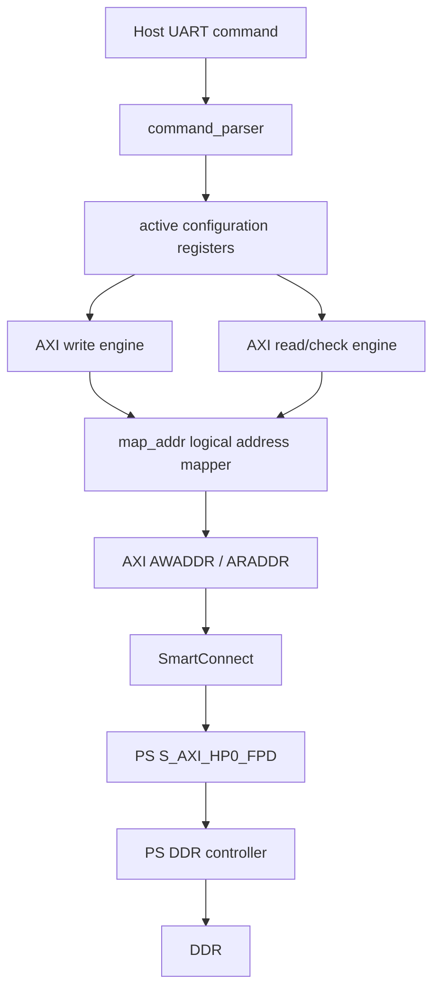
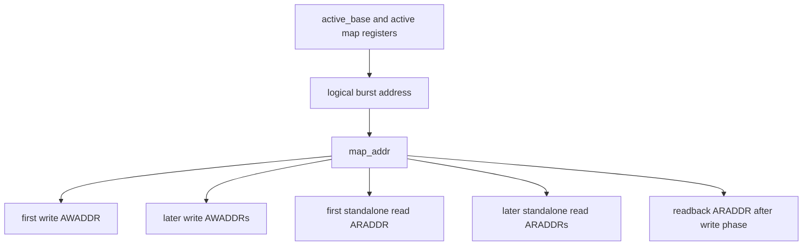
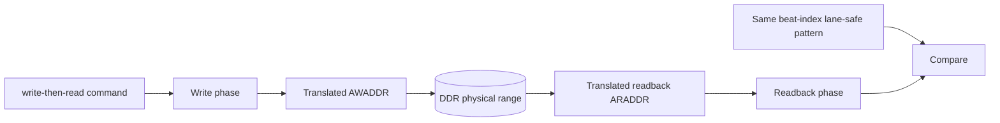

# PL-to-PS DDR Address Translation Design Report

## 1. Purpose

This report documents the address translation layer used by the PL DDR tester to
access PS DDR through `S_AXI_HP0_FPD` on the ZU4EV board.

The translation layer exists because the board has 4 GiB of PS DDR, but ZynqMP
does not expose that entire DDR as one continuous low 32-bit AXI address range
to the PL master. The low 2 GiB appears in the normal low DDR window, while the
upper 2 GiB is exposed through a high 64-bit DDR window.

The translation layer lets the host issue a simple logical DDR test range such
as:

```text
logical 0x00000000 .. 0xffffffff
```

while the FPGA issues the correct physical AXI addresses:

```text
physical 0x0000000000000000 .. 0x000000007fffffff
physical 0x0000000800000000 .. 0x000000087fffffff
```

## 2. Board And Memory Background

Target board/device:

```text
FPGA/SoC  : Zynq UltraScale+ MPSoC ZU4EV
Part      : xczu4ev-sfvc784-2-i
DDR       : 4 GiB DDR4
DDR chips : 4 x Hynix H5AN8G6NDJR-XNC, 8 Gb x16 each
PL port   : PS S_AXI_HP0_FPD
AXI width : 64-bit data, 64-bit address
PL clock  : 200 MHz external sys_clk
```

The DDR is physically 4 GiB:

```text
8 Gb/device * 4 devices = 32 Gb = 4 GiB
```

The build script corrects the PS DDR geometry to match the actual fitted memory
devices and enables high-address DDR access. The generated block design must
contain both DDR segments for `ddr_tester_0/M_AXI`:

```text
HP0_DDR_LOW  offset=0x0000000000000000 range=0x0000000080000000
HP0_DDR_HIGH offset=0x0000000800000000 range=0x0000000800000000
```

The build intentionally fails if the `DDR_HIGH` segment is not assigned to the
PL tester master. This prevents software-side workarounds from hiding a wrong PS
address map.

## 3. Problem Statement

Without translation, the PL tester uses the host-provided `base_addr` directly as
the AXI address.

For example:

```text
base_addr  = 0x0000000010000000
test_bytes = 0x0000000080000000
```

The logical test range is:

```text
0x10000000 .. 0x8fffffff
```

The first part is valid low DDR:

```text
0x10000000 .. 0x7fffffff
```

The second part is not valid in the low DDR window:

```text
0x80000000 .. 0x8fffffff
```

The actual upper DDR is not at `0x80000000`; it starts at:

```text
0x0000000800000000
```

Therefore, a no-map test crossing `0x80000000` can produce AXI response errors.
This was observed with a 2 GiB no-map test from `0x10000000`, while a 1.75 GiB
no-map test ending exactly at `0x7fffffff` passed.

## 4. Design Goal

The address translation layer must provide:

- A simple logical address space for the host.
- Access to both low and high PS DDR windows.
- Runtime-configurable split and high physical base.
- Default enabled mapping for normal use.
- A query command to inspect the active FPGA mapping state.
- Backward compatibility with older START command payloads.
- No measurable performance penalty in the current bandwidth regime.

The host-facing logical address space is:

```text
logical 0x00000000 .. 0xffffffff
```

The default physical mapping is:

```text
logical 0x00000000 .. 0x7fffffff -> physical 0x0000000000000000 .. 0x000000007fffffff
logical 0x80000000 .. 0xffffffff -> physical 0x0000000800000000 .. 0x000000087fffffff
```

## 5. High-Level Architecture

The address translation layer is inside `rtl/pl_ps_ddr_mem_test_top.v`.

It sits between the command/configuration registers and the AXI AW/AR address
generation logic:



The translation is applied only to AXI address-channel addresses. It does not
modify data, strobes, burst length, burst size, pattern generation, or compare
logic.

## 6. Mapping Formula

The RTL function is:

```verilog
function [63:0] map_addr;
    input [63:0] logical_addr;
    input [7:0]  map_flags;
    input [63:0] logical_split;
    input [63:0] physical_high_base;
    begin
        if (map_flags[0] && logical_addr >= logical_split) begin
            map_addr = physical_high_base + (logical_addr - logical_split);
        end else begin
            map_addr = logical_addr;
        end
    end
endfunction
```

Meaning:

```text
if address translation is disabled:
    axi_addr = logical_addr

if address translation is enabled and logical_addr < logical_split:
    axi_addr = logical_addr

if address translation is enabled and logical_addr >= logical_split:
    axi_addr = physical_high_base + (logical_addr - logical_split)
```

Only `map_flags[0]` is currently defined:

```text
bit 0 = 1: enable two-segment address translation
bit 0 = 0: disable translation, direct logical-to-physical addressing
```

Other bits are reserved.

## 7. Default Configuration

After reset, the FPGA default mapping state is:

```text
active_map_flags          = 0x01
active_logical_split      = 0x0000000080000000
active_physical_high_base = 0x0000000800000000
```

This means address translation is enabled by default.

The host script also enables mapping by default. The normal START command from
the host uses the mapped START format unless `--no-addr-map` is specified.

Default host values:

```text
--logical-split       0x80000000
--physical-high-base  0x800000000
```

## 8. Configuration Lifetime

The active translation configuration is stored in FPGA registers:

```text
active_map_flags
active_logical_split
active_physical_high_base
```

These registers are updated when a START command is accepted.

They are not updated when a START command is rejected due to:

```text
BUSY
BAD_ALIGN
BAD_SIZE
BAD_FRAME
```

They are initialized to the default enabled mapping after reset or bitstream
programming.

The query command returns the currently active configuration, not merely the host
defaults.

## 9. Query Command

The host can query the active FPGA address translation configuration without
starting a DDR test:

```powershell
python .\host\pl_ps_ddr_test.py --port COM6 --query-map
```

Host-to-FPGA frame:

```text
TYPE = 0x02
LEN  = 0
```

FPGA-to-host response:

```text
TYPE = 0x83
LEN  = 18
```

Response payload:

```text
offset size field
0      1    busy
1      1    addr_map_flags
2      8    logical_split
10     8    physical_high_base
```

Example output:

```text
PL ADDRESS TRANSLATION CONFIG
busy                : 0
map_flags           : 0x01
addr_map_enabled    : True
logical_split       : 0x0000000080000000
physical_high_base  : 0x0000000800000000
```

`busy` is asserted when the tester is not idle or has an unsent result pending.

## 10. START Protocol Details

The current preferred mapped START frame uses 64-bit `test_bytes`:

```text
TYPE = 0x01
LEN  = 38
```

Payload:

```text
offset size field
0      8    base_addr, logical address
8      8    test_bytes
16     4    pattern_seed
20     1    flags
21     1    addr_map_flags
22     8    logical_split
30     8    physical_high_base
```

The current preferred no-map START frame is:

```text
TYPE = 0x01
LEN  = 21
```

Payload:

```text
offset size field
0      8    base_addr, direct AXI address
8      8    test_bytes
16     4    pattern_seed
20     1    flags
```

The FPGA still accepts older 32-bit-size START formats:

```text
LEN = 17, no-map, 32-bit test_bytes
LEN = 34, mapped, 32-bit test_bytes
```

For those old formats, the FPGA zero-extends `test_bytes` to 64 bits internally.

## 11. RESULT Protocol Details

The current RESULT frame uses 64-bit `test_bytes`:

```text
TYPE = 0x82
LEN  = 62
```

Payload:

```text
offset size field
0      1    status
1      8    base_addr
9      8    test_bytes
17     1    flags
18     4    pattern_seed
22     8    write_cycles
30     8    read_cycles
38     4    error_count
42     4    first_mismatch_index
46     8    first_mismatch_expected
54     8    first_mismatch_actual
```

The host decoder still accepts older `RESULT LEN = 58` frames with 32-bit
`test_bytes` for compatibility with older bitstreams.

## 12. Host Behavior

Relevant host script:

```text
host/pl_ps_ddr_test.py
```

Default behavior:

```text
address translation enabled
START LEN = 38
test_bytes is encoded as uint64
logical_split = 0x80000000
physical_high_base = 0x800000000
```

Normal command:

```powershell
python .\host\pl_ps_ddr_test.py --port COM6 --base 0x10000000 --bytes 0x80000000 --seed 0x13579bdf --flags 0x03
```

Equivalent explicit mapped command:

```powershell
python .\host\pl_ps_ddr_test.py --port COM6 --addr-map --base 0x10000000 --bytes 0x80000000 --seed 0x13579bdf --flags 0x03
```

`--addr-map` is kept for compatibility and readability. Mapping is already the
default.

Explicit no-map command:

```powershell
python .\host\pl_ps_ddr_test.py --port COM6 --no-addr-map --base 0x10000000 --bytes 0x70000000 --seed 0x13579bdf --flags 0x03
```

`--no-addr-map` sends `LEN = 21` and disables translation for that accepted
command.

## 13. Address Generation In The AXI State Machine

The tester issues fixed-size AXI bursts:

```text
AXI data width = 64 bits = 8 bytes
BURST_BEATS    = 16
BURST_BYTES    = 16 * 8 = 128 bytes
```

The host-provided `base_addr` and `test_bytes` must be 128-byte aligned.

The RTL computes:

```verilog
cmd_bursts = cmd_bytes >> 7;
```

because each burst transfers 128 bytes.

For burst `N`, the logical burst start address is:

```text
logical_burst_addr = active_base + (N * 128)
```

The actual AXI address is:

```text
axi_burst_addr = map_addr(logical_burst_addr,
                          active_map_flags,
                          active_logical_split,
                          active_physical_high_base)
```

The same mapping function is used for:



This is important. If write used translated addresses but readback used raw
logical addresses, a write-then-read test could falsely fail or verify the wrong
physical memory.

## 14. Split Boundary Behavior

The mapping decision is made per AXI burst start address.

With the default split:

```text
logical_split = 0x80000000
```

the final low-window burst starts at:

```text
0x7fffff80
```

and covers:

```text
0x7fffff80 .. 0x7fffffff
```

The first high-window burst starts at:

```text
0x80000000
```

and maps to:

```text
0x0000000800000000
```

Because both `base_addr` and `logical_split` are required to be 128-byte aligned,
no AXI burst crosses the split. This keeps the mapping logic simple and avoids
splitting a single AXI burst into two physical address windows.

If a custom split is used, the FPGA requires:

```text
logical_split[6:0] == 0
physical_high_base[6:0] == 0
```

If these are not true, the command is rejected with:

```text
ACK: BAD_ALIGN (0x02)
```

## 15. Size And Alignment Rules

The FPGA validates:

```text
base_addr[6:0] == 0
test_bytes != 0
test_bytes[6:0] == 0
test_bytes <= 0x100000000
```

Violations return:

```text
BAD_ALIGN for base or mapping alignment problems
BAD_SIZE  for zero, unaligned, or too-large size
```

Examples of invalid sizes:

```text
0xffffffff  invalid, low 7 bits are 0x7f
0x7fffffff  invalid, low 7 bits are 0x7f
0x0000ffff  invalid, low 7 bits are 0x7f
```

Examples of valid sizes:

```text
0x00000080   128 bytes
0x00001000   4 KiB
0x01000000   16 MiB
0x80000000   2 GiB
0x100000000  4 GiB
```

## 16. Full 4 GiB Coverage

Because `test_bytes` is now 64-bit, one command can represent exactly 4 GiB:

```powershell
python .\host\pl_ps_ddr_test.py --port COM6 --base 0x00000000 --bytes 0x100000000 --seed 0x13579bdf --flags 0x03 --timeout 1200
```

Logical range:

```text
0x00000000 .. 0xffffffff
```

Physical ranges with default mapping:

```text
0x0000000000000000 .. 0x000000007fffffff
0x0000000800000000 .. 0x000000087fffffff
```

This is destructive to all DDR contents. It should only be run when PS software
is not using DDR or when the full DDR range is intentionally reserved for this
test.

If the low 256 MiB should be avoided, use:

```powershell
python .\host\pl_ps_ddr_test.py --port COM6 --base 0x10000000 --bytes 0xF0000000 --seed 0x13579bdf --flags 0x03 --timeout 900
```

Logical range:

```text
0x10000000 .. 0xffffffff
```

Physical ranges:

```text
0x0000000010000000 .. 0x000000007fffffff
0x0000000800000000 .. 0x000000087fffffff
```

## 17. Direct Physical High Address Tests

Because mapping is now enabled by default, a direct physical high address such as
`0x800000000` should not be used with default mapping unless the mapping is
customized. With default mapping enabled, that value is treated as a logical
address and remapped again.

For a direct physical high-address test, explicitly disable translation:

```powershell
python .\host\pl_ps_ddr_test.py --port COM6 --no-addr-map --base 0x800000000 --bytes 0x1000 --seed 0x13579bdf --flags 0x03 --timeout 10
```

For a logical high-DDR test using the default translation, use:

```powershell
python .\host\pl_ps_ddr_test.py --port COM6 --base 0x80000000 --bytes 0x1000 --seed 0x13579bdf --flags 0x03 --timeout 10
```

This maps logical `0x80000000` to physical `0x800000000`.

## 18. Read And Write Correctness

The address translation layer does not alter the data pattern. Pattern generation
uses the AXI beat index, not the physical address.

The current lane-safe pattern intentionally gives each adjacent pair of 64-bit
AXI beats the same value. This avoids false failures on paths that duplicate
64-bit half-beats during PS-side width conversion.

For a write-then-read command:



Therefore, if address translation is correct and DDR returns the written data,
the compare passes across the low/high split boundary.

## 19. Performance Impact

The translation logic is a simple compare/subtract/add mux on the AXI address
generation path. It is applied once per 128-byte burst, not once per byte.

Measured results showed no observable throughput penalty:

```text
16 MiB no-map low DDR       write 479.089 MiB/s, read 454.583 MiB/s, PASS
16 MiB self-map low DDR     write 479.089 MiB/s, read 454.582 MiB/s, PASS
16 MiB default high mapping write 479.089 MiB/s, read 454.582 MiB/s, PASS
```

The dominant performance limits are the AXI/DDR path behavior and transaction
sequencing, not the translation arithmetic.

## 20. Verified Scenarios

Known-good scenarios include:

```text
4 KiB direct physical high address with no-map
4 KiB logical high address mapped to physical high DDR
128 KiB boundary-crossing test around logical 0x80000000
16 MiB logical high DDR mapped to physical high DDR
2 GiB test from logical 0x10000000 crossing the split
4 KiB 64-bit RESULT protocol sanity test after test_bytes widening
```

Example successful 2 GiB split-crossing test:

```powershell
python pl_ps_ddr_test.py --port COM6 --base 0x10000000 --bytes 0x80000000 --seed 0x13579bdf --flags 0x03 --addr-map
```

Observed result:

```text
status       : OK (0x00)
base_addr    : 0x0000000010000000
test_bytes   : 0x80000000 (2147483648 bytes)
write_mibps  : 479.089
read_mibps   : 454.582
error_count  : 0
result       : PASS
```

## 21. Failure Modes And Diagnostics

### BAD_SIZE

Cause:

```text
test_bytes == 0
test_bytes is not 128-byte aligned
```

Typical examples:

```text
0xffffffff -> BAD_SIZE
0x7fffffff -> BAD_SIZE
0xffff     -> BAD_SIZE
```

Use the nearest lower 128-byte aligned size, or use exactly `0x100000000` for a
full 4 GiB test.

### BAD_ALIGN

Cause:

```text
base_addr is not 128-byte aligned
logical_split is not 128-byte aligned
physical_high_base is not 128-byte aligned
```

### TEST_FAILED With First Mismatch Not Meaningful

`error_count` currently counts both AXI response errors and data mismatches. The
first mismatch fields are populated for data compare failures. AXI response error
diagnostics are not yet split into separate first-error fields.

If a no-map test crosses `0x80000000`, the likely cause is AXI response errors
from addressing outside the low DDR window.

### Unexpected High Address Behavior

If testing physical high addresses directly, remember mapping is enabled by
default. Use `--no-addr-map` for direct physical addresses, or use logical high
addresses with the default mapping.

## 22. Design Limitations

Current limitations:

- Only one split point is supported.
- Only two segments are supported: low direct segment and high remapped segment.
- The RTL accepts sizes up to `0x100000000`, matching this 4 GiB board.
- The host does not currently prove that `base_addr + test_bytes` remains inside
  the intended logical 4 GiB window.
- The FPGA maps burst start addresses only; therefore split and base alignment
  are required so bursts do not straddle a split.
- AXI response errors and data mismatches share `error_count`.

Possible future extensions:

- More than two address segments.
- Host-side logical range validation.
- Separate counters for write response errors, read response errors, and data
  mismatches.
- First AXI error address and response code reporting.
- Config query including active `base_addr`, `test_bytes`, and last command
  status.

## 23. Source File Reference

Main RTL:

```text
rtl/pl_ps_ddr_mem_test_top.v
```

Relevant RTL blocks:

```text
map_addr()
command_parser
response_sender
active_map_flags
active_logical_split
active_physical_high_base
AXI AWADDR/ARADDR generation in ST_WRITE_B and ST_READ_R
```

Host script:

```text
host/pl_ps_ddr_test.py
```

Protocol documentation:

```text
PROTOCOL.md
```

General project documentation:

```text
README.md
REPORT.md
```

## 24. Summary

The address translation layer is a small PL-side logical-to-physical AXI address
mapper. It lets the host treat the board DDR as a simple 4 GiB logical range
while still issuing correct AXI addresses for ZynqMP's split low/high DDR memory
map.

The default configuration maps:

```text
logical 0x00000000 .. 0x7fffffff -> physical 0x0000000000000000 .. 0x000000007fffffff
logical 0x80000000 .. 0xffffffff -> physical 0x0000000800000000 .. 0x000000087fffffff
```

The host enables this by default, the FPGA enables it after reset, and
`--query-map` provides runtime visibility into the active FPGA configuration.
