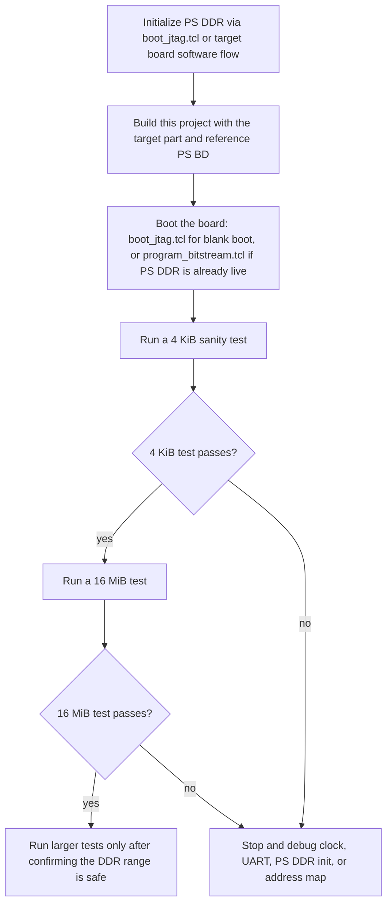
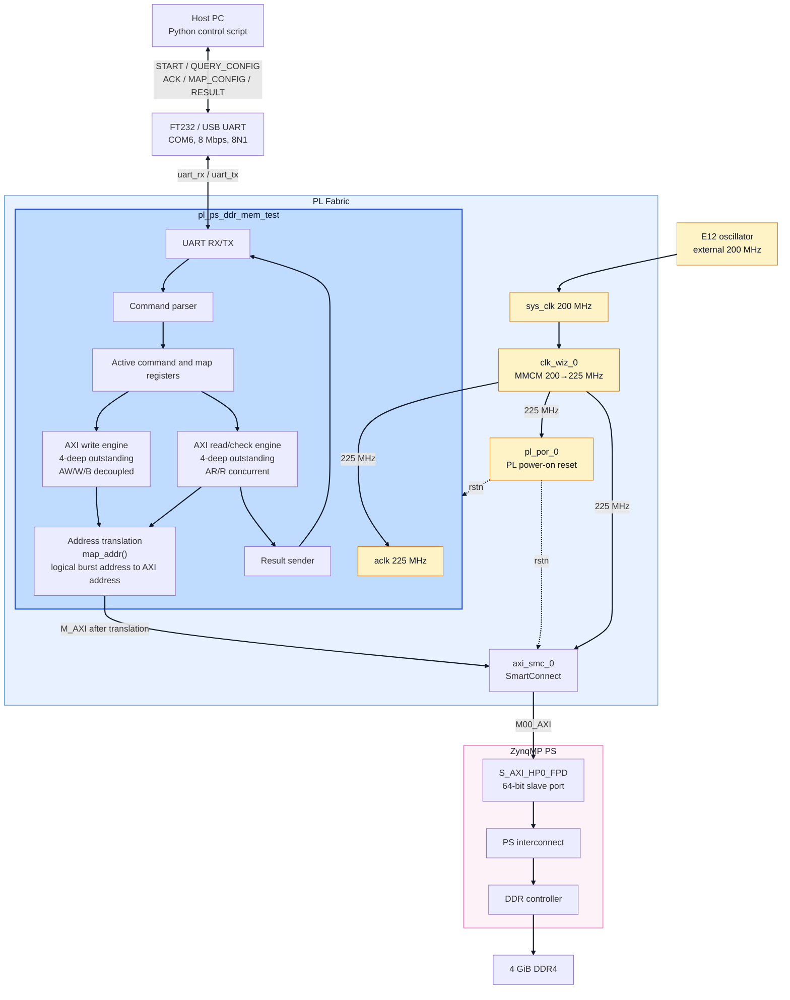
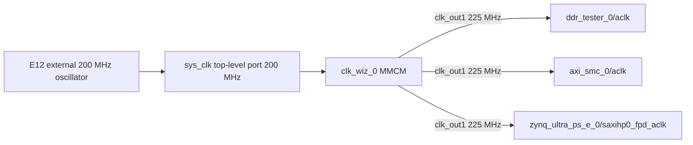
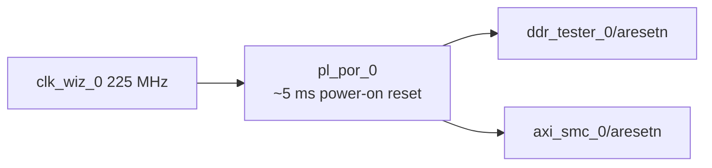
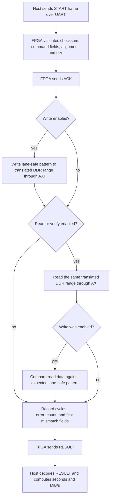
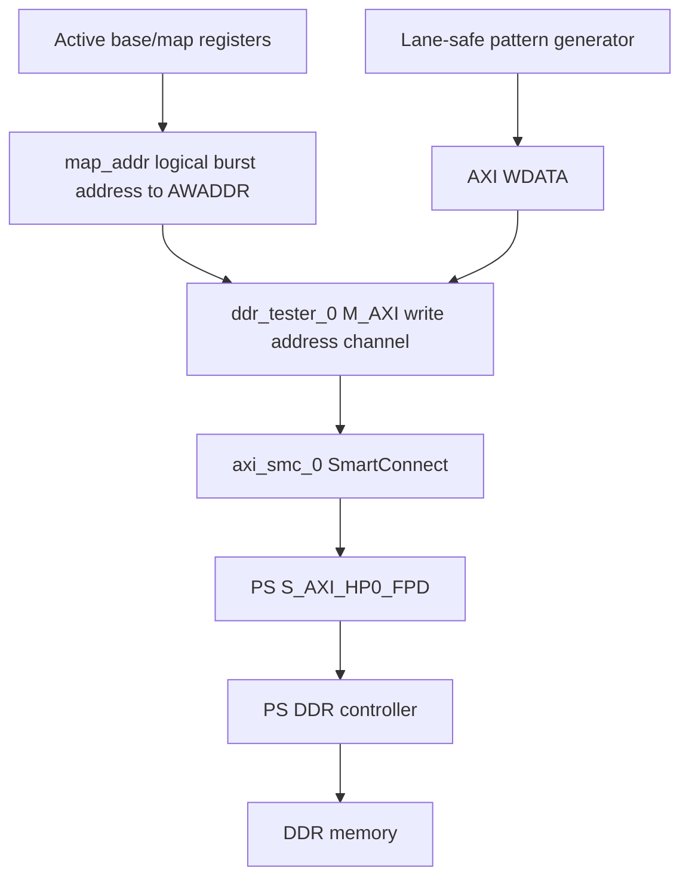
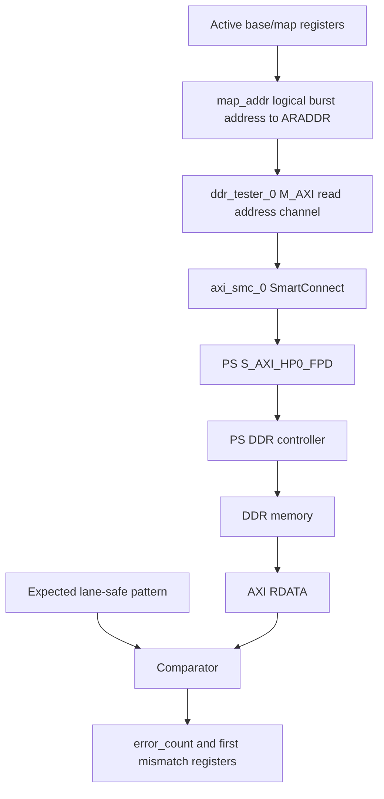
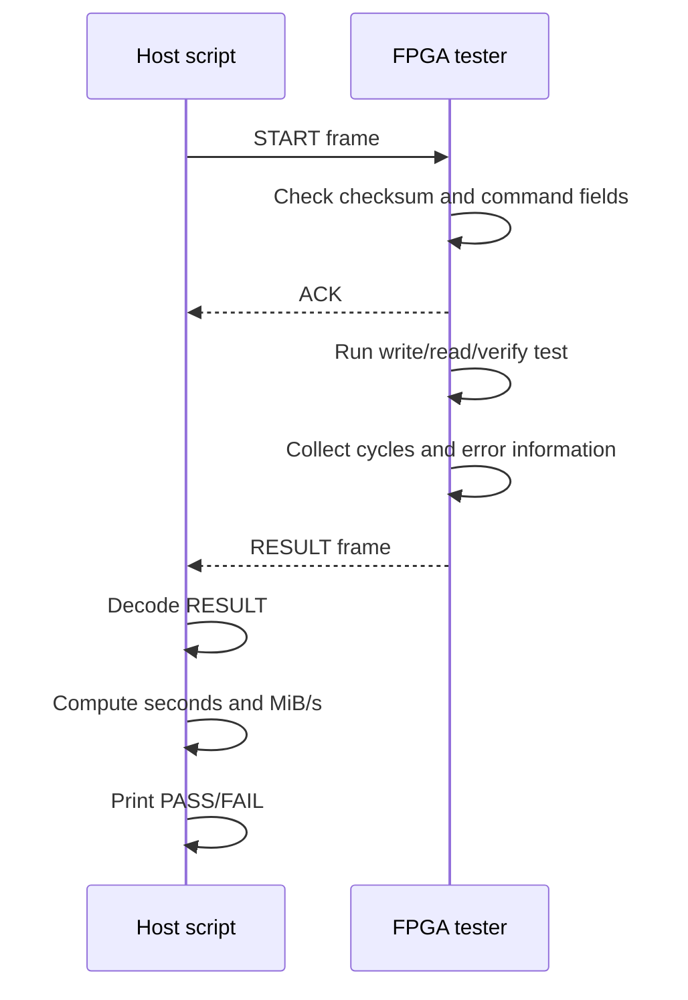

# PL to PS DDR Memory Test for ZU4EV

This project builds a Zynq UltraScale+ MPSoC design that lets PL logic test PS
DDR through a PS HP AXI port. A PC controls the test through a PL UART link,
and the FPGA reports raw cycle counts, verification status, and first-mismatch
debug information.

The current tested design uses the board 200 MHz PL oscillator on E12 upscaled
to 225 MHz via an MMCM, an 8 Mbps fractional-divider UART, and a 64-bit AXI
master with 64-beat bursts and 4-deep outstanding on both write and read
paths, connected to PS DDR through `S_AXI_HP0_FPD`.

## Current Status

- Build: passing.
- Bitstream generation: passing.
- XSA export for FSBL generation: passing.
- JTAG blank boot (PS + PL both start blank, no ROM/eMMC writes): passing.
- JTAG programming: passing.
- UART command/response: passing at 8 Mbps.
- 4 KiB write/read/verify: passing.
- 16 MiB write/read/verify: passing.
- 1 GiB write/read/verify: passing.
- Direct PS DDR high-address access at `0x800000000`: passing.
- Host-configurable logical-to-physical address translation: passing.
- Address translation is enabled by default and can be queried with `--query-map`.
- 64-bit `test_bytes` protocol: passing, including support for one-command 4 GiB size `0x100000000`.
- Logical low/high boundary crossing at `0x7fff0000 .. 0x8000ffff`: passing.
- PL-local power-on reset (`rtl/pl_por.v`): tester responds to UART right after bitstream load, before any PS firmware runs.
- Final measured throughput after Stage A+B+D optimization (64-beat bursts,
  4-deep outstanding write/read, MMCM 225 MHz):
  - With JTAG blank boot (no Linux): Write ~`1717 MiB/s`, Read ~`1717 MiB/s`.
  - Both write and read achieve 100% of the 225 MHz × 64-bit AXI peak.

## Quick Start Usage Guide

Use this section when starting from a clean checkout.

Prerequisites:

- Vivado 2024.2 is installed. In the examples below, replace `<VIVADO_INSTALL>`
  with your Vivado installation directory, for example `C:\Xilinx\Vivado\2024.2`.
- Vitis 2024.2 is installed (for FSBL and BOOT.BIN generation). Replace
  `<VITIS_INSTALL>` with your Vitis installation directory, for example
  `C:\Xilinx\Vitis\2024.2`. The `xsct.bat` and `bootgen.bat` tools are in its
  `bin` subdirectory.
- Python 3 is installed.
- `pyserial` is installed with `python -m pip install pyserial`.
- The ZU4EV board is connected through JTAG.
- The UART appears as `COM6` on the host PC.
- The DDR range under test is not used by PS software.

The build script exports `pl_ps_ddr_mem_test.xsa` (hardware platform with
bitstream) for FSBL generation. The PL tester includes a self-contained
power-on reset (`rtl/pl_por.v`), so the UART debug path is alive right after
bitstream load without depending on PS `pl_resetn0`.

### Boot Mode A: JTAG Blank Boot (PS + PL both start blank)

This mode uses `psu_init.tcl` (auto-generated by Vivado) to initialize all PS
registers directly through JTAG, then programs the bitstream. No FSBL, Linux,
or persistent boot image is required. Nothing is written to board ROM or eMMC.

Step 1, build the bitstream and export XSA:

```powershell
& "<VIVADO_INSTALL>\bin\vivado.bat" -mode batch -source build_pl_ps_ddr_mem_test.tcl
```

Step 2, start the JTAG boot (initializes PS DDR, then programs bitstream):

```powershell
& "<VIVADO_INSTALL>\bin\xsdb.bat" boot_jtag.tcl
```

Step 3, run a 4 KiB sanity test:

First confirm the FPGA's active address translation settings:

```powershell
python .\host\pl_ps_ddr_test.py --port COM6 --query-map
```

Expected default mapping:

```text
map_flags           : 0x01
addr_map_enabled    : True
logical_split       : 0x0000000080000000
physical_high_base  : 0x0000000800000000
```

Then run the test:

```powershell
python .\host\pl_ps_ddr_test.py --port COM6 --base 0x10000000 --bytes 0x1000 --seed 0x13579bdf --flags 0x03 --timeout 10
```

Step 4, run the default 16 MiB test:

```powershell
python .\host\pl_ps_ddr_test.py --port COM6 --base 0x10000000 --bytes 0x01000000 --seed 0x13579bdf --flags 0x03 --timeout 60
```

Step 5, optionally run a 1 GiB long test:

```powershell
python .\host\pl_ps_ddr_test.py --port COM6 --base 0x10000000 --bytes 0x40000000 --seed 0x13579bdf --flags 0x03 --timeout 180
```

A successful test prints:

```text
ACK: OK (0x00)
error_count  : 0
result       : PASS
```

The host script defaults are already matched to the final bitstream:

```text
baud   = 8000000
clk_hz = 225000000
```

### Boot Mode B: SD/QSPI Boot with FSBL (Persistent)

For stand-alone boot without a host PC JTAG connection, generate a `BOOT.BIN`
containing FSBL + bitstream and flash it to SD or QSPI.

Step 1, build the bitstream (produces XSA):

```powershell
& "<VIVADO_INSTALL>\bin\vivado.bat" -mode batch -source build_pl_ps_ddr_mem_test.tcl
```

Step 2, build the FSBL from the XSA:

```powershell
& "<VITIS_INSTALL>\bin\xsct.bat" tools\create_fsbl.tcl
```

Step 3, create the BOOT.BIN:

```powershell
& "<VITIS_INSTALL>\bin\xsct.bat" tools\create_boot_image.tcl
```

Step 4, copy `BOOT.BIN` to a FAT-formatted SD card, set the board boot mode to
SD, and power on. The FSBL initializes PS DDR and then loads the bitstream to
PL. After boot, run the host test script as in Mode A.

### UART Debug Capture

The `tools/uart_capture.py` script captures raw UART traffic for debugging:

```powershell
python tools\uart_capture.py --port COM6 --query          # send query, show reply
python tools\uart_capture.py --port COM6 --duration 5      # passive capture for 5 s
python tools\uart_capture.py --port COM6 --send-hex 55AA0200FE   # send raw bytes
```

## Hardware Summary

- Board/SoC: ZU4EV, `xczu4ev-sfvc784-2-i`.
- Vivado: 2024.2. Replace `<VIVADO_INSTALL>` in command examples with your local Vivado installation directory.
- DDR capacity: 4 GiB, implemented with four Hynix `H5AN8G6NDJR-XNC` 8 Gb x16 DDR4 devices.
- DDR configuration in this project: 8 Gb x16 devices, four components, 64-bit bus, DDR4-2400P timing at 600 MHz DDR interface clock (the PS DDR controller on ZU4EV supports up to DDR4-2400; the memory devices are rated 3200 MT/s but the PS IP limit is 2400 MT/s).
- PL reference clock: 200 MHz external single-ended oscillator on E12.
- PL AXI clock: 225 MHz, generated by an MMCM (`clk_wiz_0`) from the 200 MHz E12 oscillator.
- UART pins: `uart_rx=D12`, `uart_tx=C12`, `LVCMOS25`.
- UART baud: 8,000,000 baud, 8N1.
- AXI port: PS `S_AXI_HP0_FPD`.
- AXI data width: 64 bit.
- AXI burst length: 64 beats.
- AXI burst byte count: 512 bytes.
- Write outstanding depth: 4 (AW/W/B channels fully decoupled).
- Read outstanding depth: 4 (AR/R channels concurrent).
- PL reset: `rtl/pl_por.v`, self-contained ~5 ms power-on reset from the 225 MHz MMCM clock.
- Default test base address: `0x10000000`.
- Default test size: 16 MiB.

## Porting And Board Configuration

This project is board-specific only in a few places. To migrate it to another
ZU+ board or another Zynq UltraScale+ part, update the following items.

### 1. Vivado Part Name

Edit `build_pl_ps_ddr_mem_test.tcl`:

```tcl
set part_name "xczu4ev-sfvc784-2-i"
```

Change this to the exact device, package, and speed grade of the target board.
The current design was validated on `xczu4ev-sfvc784-2-i`.

### 2. PS And DDR Configuration Source

The script imports PS/DDR settings from the local reference block design copied
into this repository:

```tcl
set ref_bd_file "./reference/design_1.bd"
```

For this board, `reference/design_1.bd` contains the PS/DDR configuration used
by the build script. Keeping this file in the repository makes the project
self-contained and avoids depending on a developer-specific absolute path.

For a different board, create or locate a known-good ZynqMP PS block design for
that board, copy its `.bd` file into `reference/`, and then point `ref_bd_file`
to the copied file. This reference design should already contain the correct DDR
configuration, MIO settings, PS clocks, and fixed IO settings for the board.

If no reference BD is available, create one in Vivado first using the board's
schematic and memory parameters, verify that PS DDR boots correctly, and then
use that BD as the configuration source. Copy it into this repository before
building so the project remains portable.

Note: the Vivado build also generates `psu_init.tcl` alongside the bitstream and
XSA. This file is used by `boot_jtag.tcl` for JTAG blank Boot. When porting to a
new board, rebuild the project so a matching `psu_init.tcl` is regenerated for
the new PS configuration.

### 3. DDR Capacity, Device Geometry, And Safe Test Range

Update the documentation and test defaults if the board DDR size differs from
4 GiB.

The tested board is populated with four Hynix `H5AN8G6NDJR-XNC` devices. Each
device is an 8 Gb x16 DDR4 component. Four x16 components form a 64-bit data bus
and provide:

```text
8 Gb/device * 4 devices = 32 Gb = 4 GiB
```

The reference BD originally carried timing and bus settings that were close to
the board configuration, but its device capacity field was effectively a 4 Gb
component configuration. That exposes only 2 GiB of DDR in Vivado's PS address
map and prevents `HP0_DDR_HIGH` from being generated. The build script now
keeps the conservative timing from the reference BD but explicitly corrects the
device geometry to the populated 8 Gb x16 parts:

```tcl
CONFIG.PSU__DDRC__DEVICE_CAPACITY {8192 MBits}
CONFIG.PSU__DDRC__DRAM_WIDTH {16 Bits}
CONFIG.PSU__DDRC__ROW_ADDR_COUNT 16
CONFIG.PSU_DDR_RAM_HIGHADDR 0xFFFFFFFF
CONFIG.PSU__HIGH_ADDRESS__ENABLE 1
CONFIG.PSU__DDR_HIGH_ADDRESS_GUI_ENABLE 1
```

Vivado 2024.2's ZynqMP PS IP does not include a named subpreset for
`H5AN8G6NDJR-XNC`; the closest reliable approach is to configure the geometry
and timing fields manually. The design intentionally does not force the memory
to its 3200 MT/s maximum rating. It uses the reference design's conservative
DDR4-2400P style timing and 600 MHz DDR interface setting because that was the
known-good operating point for this board and PS initialization flow.

After this correction, the generated PS address map contains both:

```text
HP0_DDR_LOW  offset 0x0000000000000000  range 0x0000000080000000
HP0_DDR_HIGH offset 0x0000000800000000  range 0x0000000800000000
```

`HP0_DDR_HIGH` is required for PL access to the upper half of the 4 GiB DDR.

Edit `build_pl_ps_ddr_mem_test.tcl` if the default test range should change:

```tcl
set test_base_addr "0x0000000010000000"
set test_bytes     "0x01000000"
```

The test overwrites DDR. On a Linux system, reserve the test range in the device
tree, kernel command line, or application memory map. For large tests, verify
that the selected range does not overlap the kernel, root filesystem, CMA,
framebuffers, DMA buffers, or user applications.

### 4. PL Clock Input

The current board has a 200 MHz single-ended oscillator on E12. The design uses
that clock as `sys_clk`, which feeds an MMCM (`clk_wiz_0`) that generates the
225 MHz AXI clock.

For another board, edit `constraints/uart_zu4ev.xdc`:

```tcl
create_clock -name sys_clk -period 5.000 [get_ports sys_clk]
set_property PACKAGE_PIN E12 [get_ports sys_clk]
set_property IOSTANDARD LVCMOS25 [get_ports sys_clk]

# E12 is not a CCIO pin; allow non-dedicated routing to MMCM
set_property CLOCK_DEDICATED_ROUTE FALSE [get_nets sys_clk_IBUF]
```

Change these fields as needed:

```text
clock period     -> match the target oscillator frequency
PACKAGE_PIN      -> target board clock pin
IOSTANDARD       -> target bank voltage and clock standard
```

The `CLOCK_DEDICATED_ROUTE FALSE` constraint is required because E12 is not a
clock-capable IO (CCIO) pin on this board. If the target board uses a CCIO pin,
this constraint can be removed.

Also update these defaults if the clock frequency changes:

```text
build_pl_ps_ddr_mem_test.tcl: pl_clk_mhz, pl_clk_hz (AXI clock after MMCM)
build_pl_ps_ddr_mem_test.tcl: clk_wiz CONFIG.CLKOUT1_REQUESTED_OUT_FREQ
rtl/config.vh: CFG_CLK_HZ
host/pl_ps_ddr_test.py: --clk-hz default
README/PROTOCOL documentation
```

### 5. UART Pins And Baud Rate

The current UART pins match the referenced Mandelbrot project:

```tcl
set_property PACKAGE_PIN D12 [get_ports uart_rx]
set_property IOSTANDARD LVCMOS25 [get_ports uart_rx]

set_property PACKAGE_PIN C12 [get_ports uart_tx]
set_property IOSTANDARD LVCMOS25 [get_ports uart_tx]
```

For another board, change the UART pins and IO standard in
`constraints/uart_zu4ev.xdc`.

If the baud rate changes, update:

```text
build_pl_ps_ddr_mem_test.tcl: uart_baud
rtl/config.vh: CFG_UART_BAUD
host/pl_ps_ddr_test.py: --baud default
README/PROTOCOL documentation
```

The UART implementation uses a fractional accumulator, so the baud rate does
not need to divide the FPGA clock exactly. The host and FPGA baud settings must
still match.

### 6. AXI Port Selection

The script currently tries to connect the tester through SmartConnect to a PS
slave AXI port, with `S_AXI_HP0_FPD` preferred:

```tcl
foreach ps_intf {S_AXI_HP0_FPD S_AXI_HPC0_FPD S_AXI_HP0} {
    ...
}
```

For another design, confirm that the selected PS AXI slave port is enabled in
the PS configuration and that its data width is compatible with the tester. The
current RTL uses a 64-bit AXI data width.

If using a different PS AXI port, update the preferred interface list and clock
pin list in `build_pl_ps_ddr_mem_test.tcl`.

### 7. Host Defaults

The host script can override all runtime test parameters from the command line.
If the new board uses different defaults, update `host/pl_ps_ddr_test.py`:

```text
--port
--baud
--clk-hz
--base
--bytes
--seed
--flags
```

The safest migration flow is:



## Top-Level Architecture



## Clock And Reset Architecture

The design uses the external 200 MHz oscillator on PL pin E12 as `sys_clk`,
which feeds an MMCM (`clk_wiz_0`) that generates the 225 MHz AXI clock. All
AXI-domain logic (tester, SmartConnect, PS HP0, and `pl_por`) runs on the
225 MHz MMCM output.



Reset is generated by a PL-local power-on reset (`rtl/pl_por.v`), independent
of `pl_resetn0` so the UART debug path is alive right after bitstream load
even when no PS firmware has run:



Clock constraints are in `constraints/uart_zu4ev.xdc`:

```tcl
create_clock -name sys_clk -period 5.000 [get_ports sys_clk]
set_property PACKAGE_PIN E12 [get_ports sys_clk]
set_property IOSTANDARD LVCMOS25 [get_ports sys_clk]

# E12 is not a CCIO pin; allow non-dedicated routing to MMCM
set_property CLOCK_DEDICATED_ROUTE FALSE [get_nets sys_clk_IBUF]
```

## Data Flow

The write/read/verify data flow is:



The AXI write data path is:



The AXI read/check path is:



## Control Flow

The host controls each test with one START frame. The FPGA responds with one ACK
and then one RESULT frame.



## UART Protocol

The protocol is documented in more detail in `PROTOCOL.md`.

Frame format:

```text
55 AA TYPE LEN PAYLOAD CHECKSUM
```

Checksum rule:

```text
(TYPE + LEN + sum(PAYLOAD) + CHECKSUM) & 0xFF == 0
```

START frame from host:

```text
TYPE = 0x01
LEN  = 21 or 38 with address mapping
```

START payload:

```text
offset size field
0      8    base_addr
8      8    test_bytes
16     4    pattern_seed
20     1    flags
```

The mapped START payload adds `addr_map_flags`, `logical_split`, and
`physical_high_base`; see `PROTOCOL.md` for the full byte layout. Older 32-bit
size START payloads (`LEN = 17` and `LEN = 34`) are still accepted by the FPGA.

ACK frame from FPGA:

```text
TYPE = 0x81
LEN  = 1
```

RESULT frame from FPGA:

```text
TYPE = 0x82
LEN  = 62
```

RESULT payload:

```text
offset size field
0      1    status
1      8    base_addr
9      8    test_bytes
17     1    flags
18     4    pattern_seed
22     8    write_cycles
30     8    read_cycles
38     4    error_count
42     4    first_mismatch_index
46     8    first_mismatch_expected
54     8    first_mismatch_actual
```

ACK status values:

```text
0x00 OK
0x01 BUSY
0x02 BAD_ALIGN
0x03 BAD_SIZE
0x7F BAD_FRAME
```

RESULT status values:

```text
0x00 PASS status
0x80 TEST_FAILED, normally error_count is non-zero
```

## Test Flags

The command `flags` byte controls test mode:

```text
0x01 write only
0x02 read only, no data compare
0x03 write then read/verify
0x00 treated as 0x03
```

Normal correctness and speed testing uses `0x03`.

## Address And Size Requirements

The current tester requires 512-byte alignment because each AXI burst is 512
bytes (64 beats × 8 bytes):

```text
base_addr[8:0] == 0
test_bytes != 0
test_bytes[8:0] == 0
test_bytes <= 0x100000000
```

If these requirements are not met, the FPGA returns `BAD_ALIGN` or `BAD_SIZE`.

## Host-Configurable Address Translation

ZynqMP DDR is not always exposed as one continuous low 32-bit address range.
On this board, the low DDR window is visible at:

```text
DDR_LOW: 0x00000000 .. 0x7fffffff
```

The high DDR window is mapped in 64-bit address space, with the useful high
window starting at:

```text
DDR_HIGH base: 0x0000000800000000
```

Without address translation, a test range such as:

```text
base  = 0x10000000
bytes = 0x80000000
```

tries to access:

```text
0x10000000 .. 0x8fffffff
```

The portion above `0x7fffffff` is not in the low DDR window, so the PS AXI port
can return response errors.

The build must expose `HP0_DDR_HIGH` in the PS address map. This project opens it
by correcting the DDR geometry to the actual 8 Gb x16 devices and enabling the
PS high-address parameters. The build script intentionally fails if the generated
BD does not assign a `DDR_HIGH` segment to `ddr_tester_0/M_AXI`; this avoids
silently masking a wrong PS configuration.

### Translation Architecture

The translation layer is inside `rtl/pl_ps_ddr_mem_test_top.v`. It is a PL-side
logical-to-physical address mapper placed directly before the AXI AW/AR address
outputs:

```text
Host Python script
    |
    | UART START, TYPE=0x01, LEN=38 by default
    v
command_parser
    |
    | base_addr, test_bytes, seed, flags
    | addr_map_flags, logical_split, physical_high_base
    v
active command/config registers
    |
    | active_base
    | active_map_flags
    | active_logical_split
    | active_physical_high_base
    v
map_addr(logical_burst_addr)
    |
    | translated 64-bit AXI address
    v
M_AXI AWADDR / ARADDR
    |
    v
SmartConnect -> PS S_AXI_HP0_FPD -> PS DDR controller
```

The mapper is not a PS address-map rewrite. It does not change the ZynqMP
configuration at runtime. It only changes the 64-bit AXI address that the PL
master presents for each DDR test burst.

The active FPGA-side registers are:

```text
active_map_flags
active_logical_split
active_physical_high_base
```

They are initialized after reset to:

```text
active_map_flags          = 0x01
active_logical_split      = 0x0000000080000000
active_physical_high_base = 0x0000000800000000
```

They are updated whenever a valid START command is accepted. Rejected commands do
not update the active mapping.

The extended START command lets the host configure a two-segment logical to
physical address translation layer in the FPGA:

```text
if logical_addr < logical_split:
    axi_addr = logical_addr
else:
    axi_addr = physical_high_base + (logical_addr - logical_split)
```

Default host mapping values:

```text
logical_split      = 0x0000000080000000
physical_high_base = 0x0000000800000000
```

With this mapping enabled, a logical range can cross the 2 GiB boundary. For
example:

```text
logical 0x7fffff80 -> physical 0x000000007fffff80
logical 0x80000000 -> physical 0x0000000800000000
logical 0x80000080 -> physical 0x0000000800000080
```

The default logical 4 GiB view is therefore:

```text
logical 0x00000000 .. 0x7fffffff -> physical 0x0000000000000000 .. 0x000000007fffffff
logical 0x80000000 .. 0xffffffff -> physical 0x0000000800000000 .. 0x000000087fffffff
```

Address generation is burst based. The tester uses 64 beats per AXI burst, 8
bytes per beat, so every burst is 512 bytes:

```text
BURST_BEATS = 64
BURST_BYTES = 512
```

For burst `N`:

```text
logical_burst_addr = active_base + (N * 512)
axi_burst_addr     = map_addr(logical_burst_addr)
```

The same `map_addr()` function is used for write AW addresses, standalone read
AR addresses, and readback AR addresses after a write phase. This guarantees
that write-then-read verification checks the same physical DDR range that was
written.

The current host enables this mapping by default. Use `--no-addr-map` only when
intentionally testing the low DDR window without translation.

Query the FPGA's currently active translation configuration:

```powershell
python .\host\pl_ps_ddr_test.py --port COM6 --query-map
```

Expected default configuration after reset or after a normal host command:

```text
map_flags           : 0x01
addr_map_enabled    : True
logical_split       : 0x0000000080000000
physical_high_base  : 0x0000000800000000
```

For the full design notes, see `ADDRESS_TRANSLATION_REPORT.md`.

Important limitations:

- The current host sends 64-bit `test_bytes`, so one command can represent
  exactly 4 GiB as `0x100000000`.
- The RTL currently accepts sizes up to `0x100000000`, matching this board's
  4 GiB DDR capacity.
- Do not test ranges used by PS/Linux/firmware.
- A burst must not cross a translation split unless the split is aligned to the
  512-byte burst size. The default split `0x80000000` is 512-byte aligned.

Full 4 GiB logical coverage in one command, if PS is not using DDR:

```powershell
python .\host\pl_ps_ddr_test.py --port COM6 --base 0x00000000 --bytes 0x100000000 --seed 0x13579bdf --flags 0x03 --timeout 1200
```

Example crossing the low/high DDR boundary:

```powershell
python .\host\pl_ps_ddr_test.py --port COM6 --base 0x7fff0000 --bytes 0x00020000 --seed 0x13579bdf --flags 0x03 --timeout 20
```

Example mapping a logical high address to physical DDR high:

```powershell
python .\host\pl_ps_ddr_test.py --port COM6 --base 0x80000000 --bytes 0x01000000 --seed 0x13579bdf --flags 0x03 --timeout 60
```

Direct physical high-address sanity test:

```powershell
python .\host\pl_ps_ddr_test.py --port COM6 --no-addr-map --base 0x800000000 --bytes 0x1000 --seed 0x13579bdf --flags 0x03 --timeout 10
```

## DDR Safety Notes

The PL accesses PS DDR through the PS DDR controller. The DDR controller must be
initialized before this test is run. Two initialization paths are supported:

- **JTAG blank boot** (`boot_jtag.tcl`): initializes PS registers directly from
  JTAG using `psu_init.tcl`, then programs the bitstream. No FSBL or Linux
  required. Nothing is written to board ROM or eMMC.
- **FSBL / SD boot** (`tools/create_boot_image.tcl`): generates a `BOOT.BIN`
  with FSBL + bitstream for stand-alone SD/QSPI boot.

The test overwrites DDR in the selected range. The default range starts at:

```text
0x10000000
```

If Linux or another PS program is running, reserve the test range or choose a
range that is not used by software. The 1 GiB test with default base overwrites:

```text
0x10000000 .. 0x4fffffff
```

## Pattern Design

The current comparator uses a lane-safe pattern at 128-bit pair granularity.
Adjacent 64-bit AXI beats intentionally carry the same value.

Reason: early debug showed a repeat behavior where adjacent 64-bit half-beats
could appear duplicated through this PS AXI path when distinct adjacent 64-bit
values were used. The lane-safe pattern avoids false failures while still
validating DDR traffic over the tested address range at 128-bit pair granularity.

Pattern logic (parameterized by `AXI_DATA_WIDTH`):

```verilog
function [31:0] pattern32;
    input [31:0] idx;
    input [31:0] seed;
    begin
        pattern32 = 32'hA5A5_0000 ^ seed ^ idx;
    end
endfunction

function [AXI_DATA_WIDTH-1:0] pattern_lane_safe;
    input [31:0] idx;
    input [31:0] seed;
    reg [31:0] p;
    begin
        p = pattern32(idx >> 1, seed);
        pattern_lane_safe = {(AXI_DATA_WIDTH/32){p}};
    end
endfunction
```

## Speed Calculation

The FPGA does not calculate MiB/s. It returns raw cycle counts:

```text
write_cycles
read_cycles
```

The host calculates time and speed:

```text
write_time_s = write_cycles / clk_hz
read_time_s  = read_cycles / clk_hz
write_mibps  = test_bytes / 1024 / 1024 / write_time_s
read_mibps   = test_bytes / 1024 / 1024 / read_time_s
```

Default host clock frequency:

```text
225000000 Hz
```

This makes speed reporting transparent and avoids FPGA divider logic.

## Build Flow

Run from this directory:

```powershell
& "<VIVADO_INSTALL>\bin\vivado.bat" -mode batch -source build_pl_ps_ddr_mem_test.tcl
```

The script performs these steps:

```text
1. Create Vivado project.
2. Add RTL and XDC files.
3. Create block design.
4. Instantiate ZynqMP PS.
5. Import PS/DDR configuration from the reference BD.
6. Enable PS DDR high address (DDR_HIGH) for full 4 GiB access.
7. Instantiate the custom DDR tester RTL module.
8. Instantiate AXI SmartConnect.
9. Instantiate pl_por_0 (PL-local power-on reset generator).
10. Create external sys_clk port (200 MHz from E12 oscillator).
11. Instantiate clk_wiz_0 (MMCM) to upscale 200 MHz to 225 MHz AXI clock.
12. Connect clk_wiz_0/clk_out1 (225 MHz) to tester, SmartConnect, PS HP0 AXI
    clock, and pl_por.
13. Connect pl_por_0/rstn to tester and SmartConnect aresetn.
14. Connect tester M_AXI through SmartConnect to PS S_AXI_HP0_FPD.
15. Export UART, DDR, and FIXED_IO ports.
16. Validate and save block design.
17. Confirm `ddr_tester_0/M_AXI` has `HP0_DDR_HIGH` assigned.
18. Generate HDL wrapper.
19. Run synthesis.
20. Run implementation.
21. Write bitstream.
22. Export hardware platform XSA (for FSBL generation).
```

The build sets `synth_checkpoint_mode None` for the block design. This avoids a
Vivado 2024.2 SmartConnect out-of-context synthesis issue observed after adding
the high DDR segment, where the OOC run failed while opening a temporary
`.Xil/.../elab.rtd` file even though the design had no RTL or parameter errors.

Generated bitstream:

```text
pl_ps_ddr_mem_test_proj/pl_ps_ddr_mem_test.runs/impl_1/system_wrapper.bit
```

## Programming Flow

There are three ways to bring the board to a testable state. Options 1 and 2
are volatile (JTAG-only) and do not modify board ROM or eMMC. Option 3 writes
a `BOOT.BIN` to an SD card or QSPI flash for stand-alone boot.

### Option 1: JTAG Blank Boot (Recommended for Development)

Use `boot_jtag.tcl` to initialize PS registers via `psu_init.tcl` and then
program the bitstream in one step. This is the recommended flow for blank PL+PS:

```powershell
& "<VIVADO_INSTALL>\bin\xsdb.bat" boot_jtag.tcl
```

Expected successful output includes:

```text
DDR readback: 10000000:   DEADBEEF
Bitstream programmed. PL POR releases tester after ~5ms.
Boot complete. PS DDR initialized, PL tester running.
```

### Option 2: Bitstream-Only Programming (UART Debug Only)

Use `program_bitstream.tcl` to program only the PL bitstream. The tester
responds to `--query-map` immediately (thanks to `pl_por`), but DDR tests will
time out because the PS DDR controller is not initialized. Use this only when
PS DDR is already initialized by a separate flow (Linux, FSBL, or a prior
`boot_jtag.tcl` run):

```powershell
& "<VIVADO_INSTALL>\bin\vivado.bat" -mode batch -source program_bitstream.tcl
```

Expected successful output includes:

```text
Detected devices: xczu4_0 arm_dap_1
Programming device: xczu4_0
PROGRAM DONE
```

### Option 3: SD/QSPI Boot with FSBL (Stand-Alone)

Use `tools/create_boot_image.tcl` to generate a `BOOT.BIN` containing FSBL +
bitstream. Copy it to an SD card, set boot mode to SD, and power on. See
[Boot Mode B](#boot-mode-b-sdqspi-boot-with-fsbl-persistent) for details.

## Host Script Usage

Default command:

```powershell
python .\host\pl_ps_ddr_test.py --port COM6 --base 0x10000000 --bytes 0x01000000 --seed 0x13579bdf --flags 0x03 --timeout 60
```

Equivalent explicit command:

```powershell
python .\host\pl_ps_ddr_test.py --port COM6 --baud 8000000 --clk-hz 225000000 --base 0x10000000 --bytes 0x01000000 --seed 0x13579bdf --flags 0x03 --timeout 60
```

Useful options:

```text
--port       UART port, default COM6
--baud       UART baud, default 8000000
--clk-hz     FPGA clock used for speed calculation, default 225000000
--base       DDR base address
--bytes      test byte count
--seed       pattern seed
--flags      test mode
--addr-map   kept for compatibility; address translation is enabled by default
--no-addr-map
             send a no-map START and disable address translation for this command
--query-map  query the active FPGA address translation configuration
--logical-split
             logical split address for the high DDR window, default 0x80000000
--physical-high-base
             physical AXI base for logical addresses above the split, default 0x800000000
--timeout    UART frame timeout in seconds
--no-flush   do not flush UART buffers before sending command
```

If `pyserial` is missing:

```powershell
python -m pip install pyserial
```

## Recommended Test Flow

After building the project, bring the board to a testable state first. For a
blank PL+PS board, run the JTAG blank boot:

```powershell
& "<VIVADO_INSTALL>\bin\xsdb.bat" boot_jtag.tcl
```

Confirm the tester is alive:

```powershell
python .\host\pl_ps_ddr_test.py --port COM6 --query-map
```

Then test from small to large ranges.

4 KiB sanity test:

```powershell
python .\host\pl_ps_ddr_test.py --port COM6 --base 0x10000000 --bytes 0x1000 --seed 0x13579bdf --flags 0x03 --timeout 10
```

16 MiB normal test:

```powershell
python .\host\pl_ps_ddr_test.py --port COM6 --base 0x10000000 --bytes 0x01000000 --seed 0x13579bdf --flags 0x03 --timeout 60
```

1 GiB long test:

```powershell
python .\host\pl_ps_ddr_test.py --port COM6 --base 0x10000000 --bytes 0x40000000 --seed 0x13579bdf --flags 0x03 --timeout 180
```

Write-only test:

```powershell
python .\host\pl_ps_ddr_test.py --port COM6 --base 0x10000000 --bytes 0x01000000 --seed 0x13579bdf --flags 0x01 --timeout 60
```

Read-only speed test without compare:

```powershell
python .\host\pl_ps_ddr_test.py --port COM6 --base 0x10000000 --bytes 0x01000000 --seed 0x13579bdf --flags 0x02 --timeout 60
```

Address-translation boundary test:

```powershell
python .\host\pl_ps_ddr_test.py --port COM6 --base 0x7fff0000 --bytes 0x00020000 --seed 0x13579bdf --flags 0x03 --timeout 20
```

Logical high-DDR test mapped to physical `0x800000000`:

```powershell
python .\host\pl_ps_ddr_test.py --port COM6 --base 0x80000000 --bytes 0x01000000 --seed 0x13579bdf --flags 0x03 --timeout 60
```

## Final Measured Results

All final tests used:

```text
clock      : 225 MHz (MMCM from 200 MHz E12 sys_clk)
UART       : 8 Mbps
base       : 0x10000000
seed       : 0x13579BDF
flags      : 0x03
AXI path   : PL -> SmartConnect -> PS S_AXI_HP0_FPD -> DDR
burst      : 64 beats × 8 bytes = 512 bytes
outstanding: 4-deep write, 4-deep read
```

### JTAG Blank Boot Results (No Linux, No FSBL)

These results were measured with `boot_jtag.tcl` (PS initialized via
`psu_init.tcl` over JTAG, no Linux, no FSBL). No PS master competes for DDR
bandwidth.

4 KiB final result:

```text
write_cycles : 549
read_cycles  : 551
write_time_s : 0.000002440
read_time_s  : 0.000002449
write_mibps  : 1600.922
read_mibps   : 1595.111
error_count  : 0
result       : PASS
```

16 MiB final result:

```text
write_cycles : 2097189
read_cycles  : 2097194
write_time_s : 0.009320840
read_time_s  : 0.009320862
write_mibps  : 1716.583
read_mibps   : 1716.579
error_count  : 0
result       : PASS
```

2 GiB final result:

```text
write_cycles : 268435493
read_cycles  : 268435498
write_time_s : 1.193046636
read_time_s  : 1.193046658
write_mibps  : 1716.614
read_mibps   : 1716.614
error_count  : 0
result       : PASS
```

4 GiB final result:

```text
write_cycles : 536870949
read_cycles  : 536870954
write_time_s : 2.386093107
read_time_s  : 2.386093129
write_mibps  : 1716.614
read_mibps   : 1716.614
error_count  : 0
result       : PASS
```

Both write and read achieve 1716.614 MiB/s = 100% of the 225 MHz × 64-bit AXI
theoretical peak (225,000,000 × 8 / 1024 / 1024 = 1716.614 MiB/s).

### Historical Baseline Results (Before Stage A+B+D Optimization)

These results were measured with the original design (200 MHz sys_clk, 16-beat
bursts, single-outstanding). Kept for reference.

4 KiB:

```text
write_mibps  : 509.289
read_mibps   : 458.211
```

16 MiB:

```text
write_mibps  : 509.023
read_mibps   : 454.583
```

1 GiB:

```text
write_mibps  : 509.031
read_mibps   : 454.583
```

## Performance Evolution

The project went through these major performance stages:

```text
96.97 MHz PS pl_clk0 baseline, 16 MiB:
write 207.667 MiB/s
read  273.631 MiB/s

200 MHz E12 sys_clk before write optimization, 16 MiB:
write 370.202 MiB/s
read  454.580 MiB/s

200 MHz E12 sys_clk after write optimization, Linux running, 16 MiB:
write 479.090 MiB/s
read  454.584 MiB/s

200 MHz E12 sys_clk after write optimization, JTAG blank boot (no Linux), 16 MiB:
write 509.031 MiB/s
read  454.583 MiB/s

Stage A: 200 MHz, 64-beat burst + write AW/W/B decoupled (4-os), 16 MiB:
write 1525.853 MiB/s (100% AXI peak)
read  940.545 MiB/s (62%)

Stage B: 200 MHz, + read 4-outstanding, 16 MiB:
write 1525.853 MiB/s (100% AXI peak)
read  1525.851 MiB/s (100% AXI peak)

Stage D: 225 MHz MMCM, 64-beat + 4-os write/read, 16 MiB:
write 1716.583 MiB/s (100% AXI peak)
read  1716.579 MiB/s (100% AXI peak)
```

The 200 MHz external clock gave the largest early improvement. Stage A (long
bursts + write decoupling) brought write to 100% of the 200 MHz AXI peak.
Stage B (read multi-outstanding) brought read to 100% as well. Stage D (MMCM
225 MHz) raised the AXI peak itself from 1526 to 1717 MiB/s, with both write
and read maintaining 100% efficiency.

See `IMPROVEMENT_PLAN.md` sections 9-10 for the detailed stage-by-stage
verification report with 2 GiB and 4 GiB test results.

## Theoretical Bandwidth Vs Measured Bandwidth

The AXI interface used by this design is 64 bits wide. One AXI data beat moves:

```text
64 bits = 8 bytes
```

If the AXI data channel transferred one valid data beat every clock cycle, the
ideal peak bandwidth would be:

```text
peak_Bps = clock_hz * 8 bytes
peak_MiBps = peak_Bps / 1024 / 1024
```

For the original 96.968727 MHz PS `pl_clk0` version:

```text
peak_Bps   = 96,968,727 * 8
           = 775,749,816 B/s

peak_MiBps = 775,749,816 / 1024 / 1024
           = 739.813 MiB/s
```

For the final 225 MHz MMCM version:

```text
peak_Bps   = 225,000,000 * 8
          = 1,800,000,000 B/s

peak_MiBps = 1,800,000,000 / 1024 / 1024
          = 1716.614 MiB/s
```

This is the best possible payload bandwidth on a 64-bit AXI data channel if
every clock cycle carries valid data. It does not include address-channel
overhead, response-channel overhead, interconnect latency, DDR controller
latency, arbitration, software traffic, or state-machine bubbles.

Measured efficiency is:

```text
efficiency = measured_MiBps / theoretical_peak_MiBps
```

Comparison table:

```text
Clock/source                 Theoretical    Measured write   Write eff.   Measured read   Read eff.
---------------------------  -------------  ---------------  -----------  --------------  ---------
96.968727 MHz PS pl_clk0     739.813 MiB/s  207.667 MiB/s    28.07%       273.631 MiB/s   36.99%
200 MHz E12 before opt       1525.879 MiB/s 370.202 MiB/s    24.26%       454.580 MiB/s   29.79%
200 MHz E12 after opt, blank 1525.879 MiB/s 509.031 MiB/s    33.36%       454.583 MiB/s   29.79%
200 MHz Stage A (64-beat+Wd) 1525.879 MiB/s 1525.853 MiB/s  100.00%       940.545 MiB/s   61.62%
200 MHz Stage B (+read 4os)  1525.879 MiB/s 1525.853 MiB/s  100.00%      1525.851 MiB/s  100.00%
225 MHz Stage D (MMCM)       1716.614 MiB/s 1716.583 MiB/s  100.00%      1716.579 MiB/s  100.00%
```

### How 100% Efficiency Was Achieved

The current design reaches 100% AXI efficiency on both write and read through:

1. **Long bursts (64 beats = 512 bytes)**: Reduces address/response overhead
   per transferred byte.
2. **Write AW/W/B fully decoupled (4-deep outstanding)**: AW issues future
   burst addresses, W streams data continuously, B collects responses in the
   background. The three channels run independently.
3. **Read AR/R concurrent (4-deep outstanding)**: AR issues future burst
   addresses while R receives data from earlier bursts. This hides DDR
   controller and interconnect round-trip latency.

### Remaining Limits

At 100% AXI efficiency, the only way to increase bandwidth further is to raise
the AXI peak itself, either by widening the data bus or increasing the clock
frequency. On this board:

- **128-bit AXI**: The PS HP0 FPD port allows 128-bit configuration in Vivado,
  but the design did not function correctly on this board. See
  `IMPROVEMENT_PLAN.md` section 9.5 for details.
- **Higher clock**: 250 MHz was attempted but failed timing (WNS=-1.063).
  225 MHz is the safe maximum with the current RTL and routing.
- **DDR4-3200**: The ZU4EV PS DDR controller IP supports up to DDR4-2400 only,
  even though the memory devices are rated 3200 MT/s. See
  `IMPROVEMENT_PLAN.md` section 9.2 for details.

## Important Implementation Details

- The tester uses 64-bit AXI data beats.
- The tester writes 64-beat bursts (512 bytes per burst).
- The write path has AW/W/B channels fully decoupled with 4-deep outstanding.
- The read path supports 4-deep outstanding with concurrent AR/R channels.
- `write_cycles` and `read_cycles` are 64-bit counters.
- The FPGA reports first mismatch information only when errors occur.
- PL reset is generated by `rtl/pl_por.v` from the 225 MHz MMCM output
  (`clk_wiz_0/clk_out1`), not from PS `pl_resetn0`. The tester and SmartConnect
  are released from reset ~5 ms after bitstream configuration, independent of
  PS firmware state. This makes the UART debug path usable immediately after
  programming, even on a blank PS.
- The MMCM (`clk_wiz_0`) upscales the 200 MHz E12 oscillator to 225 MHz for the
  AXI domain. E12 is not a CCIO pin, so `CLOCK_DEDICATED_ROUTE FALSE` is used.
- PS DDR initialization is performed by `boot_jtag.tcl` (via `psu_init.tcl` over
  JTAG) or by FSBL/SD boot. The bitstream alone does not initialize DDR.

## Troubleshooting

No ACK from FPGA:

- Confirm the latest bitstream was programmed.
- Confirm COM6 is correct and not used by another program.
- Confirm host baud is `8000000`.
- Confirm the E12 200 MHz oscillator is present and constrained as `sys_clk`.
- Confirm PS DDR initialization has completed. For blank boot, run
  `boot_jtag.tcl` first; verify it prints `DDR readback: ... DEADBEEF`.
- If only programming the bitstream (no PS init), the tester responds to
  `--query-map` but DDR tests will time out because the DDR controller is
  not initialized.

ACK is OK but RESULT times out:

- PS DDR controller is not initialized. Run `boot_jtag.tcl` to initialize
  PS registers via `psu_init.tcl` before running DDR tests.
- Use `tools/uart_capture.py --port COM6 --query` to verify the tester is
  alive independently of DDR.

ACK is `BAD_ALIGN`:

- Use a 512-byte-aligned base address.

ACK is `BAD_SIZE`:

- Use a non-zero test size that is a multiple of 512 bytes.
- Use `0x100000000` for exactly 4 GiB; do not use `0xffffffff`, which is not 512-byte aligned.
- Keep `--bytes` less than or equal to `0x100000000` for this 4 GiB design.

RESULT is `TEST_FAILED`:

- Check `error_count`.
- Check `first_mismatch_index`.
- Check `first_mismatch_expected` and `first_mismatch_actual`.
- Verify the test range is not used by Linux or other PS software.
- Try a smaller range such as 4 KiB first.

UART checksum or timeout errors:

- Confirm baud is 8 Mbps on both FPGA and host.
- Try `--no-flush` only if flushing causes problems.
- Reprogram the bitstream and rerun the 4 KiB test.

Unexpected low speed:

- Confirm `--clk-hz 225000000` is used.
- Confirm the bitstream is the 225 MHz MMCM version.
- Confirm the host is parsing the 64-bit cycle RESULT layout.
- Check whether PS/Linux traffic is also using DDR.

## Current Limitations

- Verification is lane-safe at 128-bit pair granularity, not unique every 64-bit
  beat.
- The selected DDR range is overwritten by the test.
- PS DDR must be initialized before the PL test can work. Use `boot_jtag.tcl`
  (JTAG blank boot via `psu_init.tcl`) or FSBL/SD boot.
- Address translation currently supports one split and two segments: direct low DDR plus remapped high DDR.
- Direct physical high-address tests require `--no-addr-map` because address translation is enabled by default.
- The ZU4EV PS DDR controller supports up to DDR4-2400; the memory devices are rated 3200 MT/s but the PS IP limit prevents using higher speeds.
- The PS HP0 FPD port does not function correctly in 128-bit mode on this board; the design stays at 64-bit AXI data width.
- PL clock is limited to 225 MHz due to timing closure (250 MHz fails with WNS=-1.063).

## Next Optimization Directions

The following optimizations have been completed:

1. ~~Increase AXI burst length from 16 beats to 64 or 256 beats.~~ Done (64 beats).
2. ~~Add multiple outstanding read bursts.~~ Done (4-deep).
3. ~~Decouple AW, W, and B channels for writes.~~ Done (4-deep outstanding).
4. ~~Keep W channel valid continuously during long bursts.~~ Done.
5. ~~Increase PL clock from 200 MHz to 225 MHz via MMCM.~~ Done.

Both write and read now achieve 100% of the 225 MHz × 64-bit AXI theoretical
peak. Further improvements would require:

6. Widen the AXI data bus to 128 bit — attempted but the PS HP0 FPD port does
   not function correctly in 128-bit mode on this board. See
   `IMPROVEMENT_PLAN.md` section 9.5.
7. Increase PL clock beyond 225 MHz — 250 MHz was attempted but failed timing
   closure. Would require RTL pipeline retiming or a faster speed grade.
8. Upgrade DDR4 to 3200 MT/s — the ZU4EV PS DDR controller IP supports up to
   DDR4-2400 only. See `IMPROVEMENT_PLAN.md` section 9.2.
9. Add optional ILA probes for AXI AW/W/B/AR/R if debugging distinct 64-bit
   beat behavior.

## Key Files

```text
build_pl_ps_ddr_mem_test.tcl
    Vivado project and block design generator. Exports XSA for FSBL.

boot_jtag.tcl
    Volatile JTAG boot: initializes PS via psu_init.tcl, then programs
    bitstream. No ROM/eMMC writes. Use for blank PL+PS development.

program_bitstream.tcl
    JTAG programming script (bitstream only, no PS init).

reference/design_1.bd
    Local reference PS/DDR block design used as the configuration source.

psu_init.tcl
    Auto-generated PS register init script. Sourced by boot_jtag.tcl to
    initialize PLL, DDR controller/PHY, MIO, clocks, and PS interconnect
    directly from JTAG without FSBL.

rtl/pl_ps_ddr_mem_test_top.v
    Main DDR tester, AXI master, UART protocol parser, result sender.

rtl/pl_por.v
    PL power-on reset generator. Produces a clean ~5 ms reset from sys_clk
    after bitstream configuration, independent of PS pl_resetn0.

rtl/uart_tx.v
    Fractional accumulator UART transmitter.

rtl/uart_rx.v
    Fractional accumulator UART receiver.

rtl/config.vh
    Default clock and UART parameters. Current default: 225 MHz AXI clock, 8 Mbps UART.

constraints/uart_zu4ev.xdc
    E12 200 MHz sys_clk, UART pin constraints, and CLOCK_DEDICATED_ROUTE for MMCM.

host/pl_ps_ddr_test.py
    Host command sender, RESULT parser, speed calculator. Default --clk-hz is 225000000.

tools/uart_capture.py
    Pyserial-based UART debug capture script.

tools/create_fsbl.tcl
    Builds ZynqMP FSBL ELF from the project XSA via HSI.

tools/create_boot_image.tcl
    Creates BOOT.BIN (FSBL + bitstream) for SD/QSPI boot.

PROTOCOL.md
    Binary UART protocol reference.

ADDRESS_TRANSLATION_REPORT.md
    Detailed architecture and design report for the PL-side address translation layer.

REPORT.md
    Engineering report summarizing design evolution and measurements.

IMPROVEMENT_PLAN.md
    Performance improvement plan and stage-by-stage verification report (Stages A-D,
    including failed Stage C/E attempts with root cause analysis).

test/
    Build logs and temporary files from the Stage A-D optimization work.
```

## License

This project is released under the MIT License. See `LICENSE` for the full text.

## AI Authorship Statement

The original DDR tester design was completed with GPT-5.5. The blank-boot
support (PL power-on reset, JTAG `psu_init.tcl` boot flow, FSBL/BOOT.BIN
generation, UART debug capture) was added with glm-5.2. The Stage A+B+D
performance optimizations (64-beat bursts, 4-deep outstanding write/read,
MMCM 225 MHz clock, full README update) were also done with glm-5.2.
