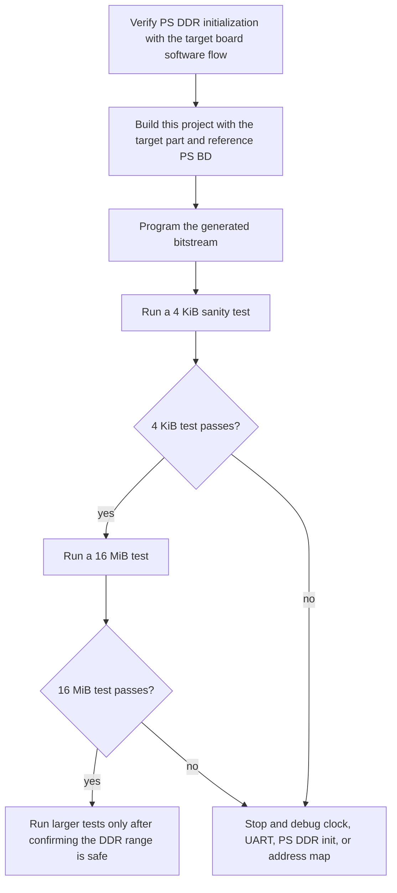
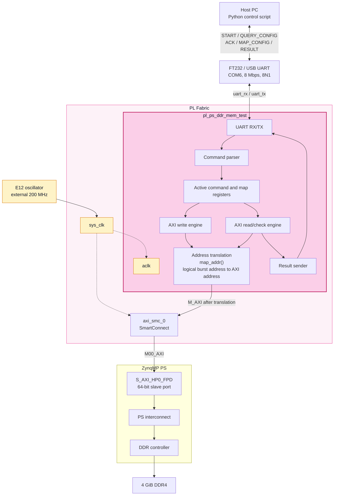
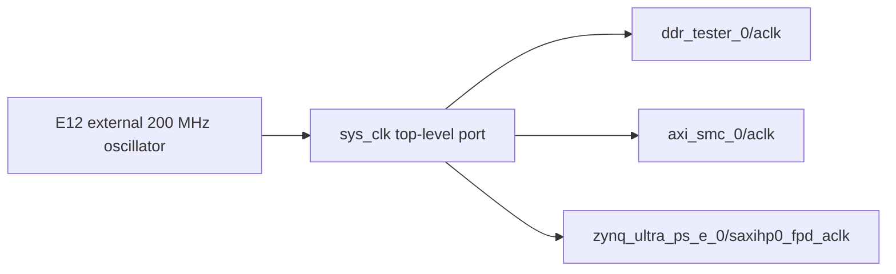
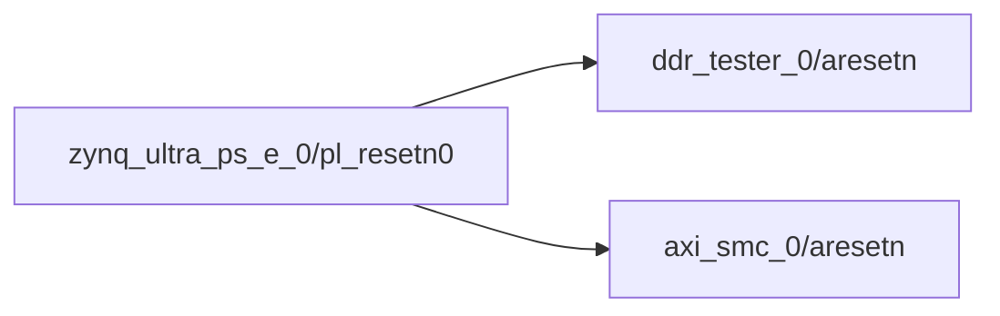
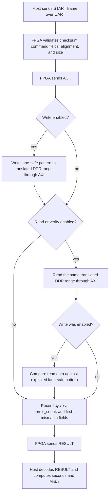
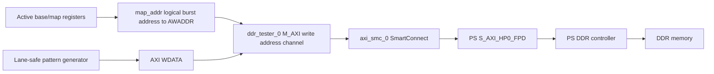
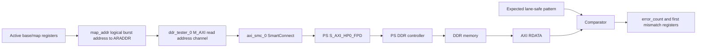
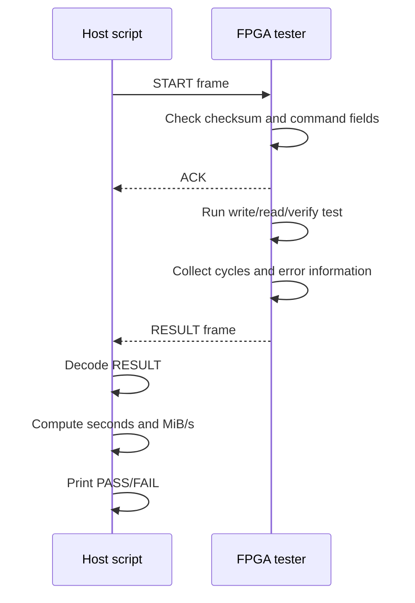

# PL to PS DDR Memory Test for ZU4EV

This project builds a Zynq UltraScale+ MPSoC design that lets PL logic test PS
DDR through a PS HP AXI port. A PC controls the test through a PL UART link,
and the FPGA reports raw cycle counts, verification status, and first-mismatch
debug information.

The current tested design uses the board 200 MHz PL oscillator on E12, an
8 Mbps fractional-divider UART, and a 64-bit AXI master connected to PS DDR
through `S_AXI_HP0_FPD`.

## Current Status

- Build: passing.
- Bitstream generation: passing.
- JTAG programming: passing.
- UART command/response: passing at 8 Mbps.
- 4 KiB write/read/verify: passing.
- 16 MiB write/read/verify: passing.
- 1 GiB write/read/verify: passing.
- Direct PS DDR high-address access at `0x800000000`: passing.
- Host-configurable logical-to-physical address translation: passing.
- Address translation is enabled by default and can be queried with `--query-map`.
- 64-bit `test_bytes` protocol: passing, including support for one-command 4 GiB size `0x100000000`.
- Logical low/high boundary crossing at `0x7fff0000 .. 0x8000ffff`: passing.
- Final measured throughput after the first write-path optimization:
  - Write: about `479 MiB/s`.
  - Read: about `455 MiB/s`.

## Quick Start Usage Guide

Use this section when starting from a clean checkout.

Prerequisites:

- Vivado 2024.2 is installed. In the examples below, replace `<VIVADO_INSTALL>`
  with your Vivado installation directory, for example `C:\Xilinx\Vivado\2024.2`.
- Python 3 is installed.
- `pyserial` is installed with `python -m pip install pyserial`.
- The ZU4EV board is connected through JTAG.
- The UART appears as `COM6` on the host PC.
- PS DDR has already been initialized by FSBL, Linux, or bare-metal startup.
- The DDR range under test is not used by PS software.

Step 1, build the bitstream:

```powershell
& "<VIVADO_INSTALL>\bin\vivado.bat" -mode batch -source build_pl_ps_ddr_mem_test.tcl
```

Step 2, program the FPGA:

```powershell
& "<VIVADO_INSTALL>\bin\vivado.bat" -mode batch -source program_bitstream.tcl
```

Step 3, run a 4 KiB sanity test:

First confirm the FPGA's active address translation settings:

```powershell
python .\host\pl_ps_ddr_test.py --port COM6 --query-map
```

Expected default mapping:

```text
map_flags           : 0x01
addr_map_enabled    : True
logical_split       : 0x0000000080000000
physical_high_base  : 0x0000000800000000
```

Then run the test:

```powershell
python .\host\pl_ps_ddr_test.py --port COM6 --base 0x10000000 --bytes 0x1000 --seed 0x13579bdf --flags 0x03 --timeout 10
```

Step 4, run the default 16 MiB test:

```powershell
python .\host\pl_ps_ddr_test.py --port COM6 --base 0x10000000 --bytes 0x01000000 --seed 0x13579bdf --flags 0x03 --timeout 60
```

Step 5, optionally run a 1 GiB long test:

```powershell
python .\host\pl_ps_ddr_test.py --port COM6 --base 0x10000000 --bytes 0x40000000 --seed 0x13579bdf --flags 0x03 --timeout 180
```

A successful test prints:

```text
ACK: OK (0x00)
error_count  : 0
result       : PASS
```

The host script defaults are already matched to the final bitstream:

```text
baud   = 8000000
clk_hz = 200000000
```

## Hardware Summary

- Board/SoC: ZU4EV, `xczu4ev-sfvc784-2-i`.
- Vivado: 2024.2. Replace `<VIVADO_INSTALL>` in command examples with your local Vivado installation directory.
- DDR capacity: 4 GiB, implemented with four Hynix `H5AN8G6NDJR-XNC` 8 Gb x16 DDR4 devices.
- DDR configuration in this project: 8 Gb x16 devices, four components, 64-bit bus, conservative DDR4-2400P timing at 600 MHz DDR interface clock.
- PL clock: 200 MHz external single-ended oscillator on E12.
- UART pins: `uart_rx=D12`, `uart_tx=C12`, `LVCMOS25`.
- UART baud: 8,000,000 baud, 8N1.
- AXI port: PS `S_AXI_HP0_FPD`.
- AXI data width: 64 bit.
- AXI burst length: 16 beats.
- AXI burst byte count: 128 bytes.
- Default test base address: `0x10000000`.
- Default test size: 16 MiB.

## Porting And Board Configuration

This project is board-specific only in a few places. To migrate it to another
ZU+ board or another Zynq UltraScale+ part, update the following items.

### 1. Vivado Part Name

Edit `build_pl_ps_ddr_mem_test.tcl`:

```tcl
set part_name "xczu4ev-sfvc784-2-i"
```

Change this to the exact device, package, and speed grade of the target board.
The current design was validated on `xczu4ev-sfvc784-2-i`.

### 2. PS And DDR Configuration Source

The script imports PS/DDR settings from the local reference block design copied
into this repository:

```tcl
set ref_bd_file "./reference/design_1.bd"
```

For this board, `reference/design_1.bd` contains the PS/DDR configuration used
by the build script. Keeping this file in the repository makes the project
self-contained and avoids depending on a developer-specific absolute path.

For a different board, create or locate a known-good ZynqMP PS block design for
that board, copy its `.bd` file into `reference/`, and then point `ref_bd_file`
to the copied file. This reference design should already contain the correct DDR
configuration, MIO settings, PS clocks, and fixed IO settings for the board.

If no reference BD is available, create one in Vivado first using the board's
schematic and memory parameters, verify that PS DDR boots correctly, and then
use that BD as the configuration source. Copy it into this repository before
building so the project remains portable.

### 3. DDR Capacity, Device Geometry, And Safe Test Range

Update the documentation and test defaults if the board DDR size differs from
4 GiB.

The tested board is populated with four Hynix `H5AN8G6NDJR-XNC` devices. Each
device is an 8 Gb x16 DDR4 component. Four x16 components form a 64-bit data bus
and provide:

```text
8 Gb/device * 4 devices = 32 Gb = 4 GiB
```

The reference BD originally carried timing and bus settings that were close to
the board configuration, but its device capacity field was effectively a 4 Gb
component configuration. That exposes only 2 GiB of DDR in Vivado's PS address
map and prevents `HP0_DDR_HIGH` from being generated. The build script now
keeps the conservative timing from the reference BD but explicitly corrects the
device geometry to the populated 8 Gb x16 parts:

```tcl
CONFIG.PSU__DDRC__DEVICE_CAPACITY {8192 MBits}
CONFIG.PSU__DDRC__DRAM_WIDTH {16 Bits}
CONFIG.PSU__DDRC__ROW_ADDR_COUNT 16
CONFIG.PSU_DDR_RAM_HIGHADDR 0xFFFFFFFF
CONFIG.PSU__HIGH_ADDRESS__ENABLE 1
CONFIG.PSU__DDR_HIGH_ADDRESS_GUI_ENABLE 1
```

Vivado 2024.2's ZynqMP PS IP does not include a named subpreset for
`H5AN8G6NDJR-XNC`; the closest reliable approach is to configure the geometry
and timing fields manually. The design intentionally does not force the memory
to its 3200 MT/s maximum rating. It uses the reference design's conservative
DDR4-2400P style timing and 600 MHz DDR interface setting because that was the
known-good operating point for this board and PS initialization flow.

After this correction, the generated PS address map contains both:

```text
HP0_DDR_LOW  offset 0x0000000000000000  range 0x0000000080000000
HP0_DDR_HIGH offset 0x0000000800000000  range 0x0000000800000000
```

`HP0_DDR_HIGH` is required for PL access to the upper half of the 4 GiB DDR.

Edit `build_pl_ps_ddr_mem_test.tcl` if the default test range should change:

```tcl
set test_base_addr "0x0000000010000000"
set test_bytes     "0x01000000"
```

The test overwrites DDR. On a Linux system, reserve the test range in the device
tree, kernel command line, or application memory map. For large tests, verify
that the selected range does not overlap the kernel, root filesystem, CMA,
framebuffers, DMA buffers, or user applications.

### 4. PL Clock Input

The current board has a 200 MHz single-ended oscillator on E12. The design uses
that clock as `sys_clk`.

For another board, edit `constraints/uart_zu4ev.xdc`:

```tcl
create_clock -name sys_clk -period 5.000 [get_ports sys_clk]
set_property PACKAGE_PIN E12 [get_ports sys_clk]
set_property IOSTANDARD LVCMOS25 [get_ports sys_clk]
```

Change these fields as needed:

```text
clock period     -> match the target oscillator frequency
PACKAGE_PIN      -> target board clock pin
IOSTANDARD       -> target bank voltage and clock standard
```

Also update these defaults if the clock frequency changes:

```text
build_pl_ps_ddr_mem_test.tcl: pl_clk_mhz, pl_clk_hz
rtl/config.vh: CFG_CLK_HZ
host/pl_ps_ddr_test.py: --clk-hz default
README/PROTOCOL documentation
```

### 5. UART Pins And Baud Rate

The current UART pins match the referenced Mandelbrot project:

```tcl
set_property PACKAGE_PIN D12 [get_ports uart_rx]
set_property IOSTANDARD LVCMOS25 [get_ports uart_rx]

set_property PACKAGE_PIN C12 [get_ports uart_tx]
set_property IOSTANDARD LVCMOS25 [get_ports uart_tx]
```

For another board, change the UART pins and IO standard in
`constraints/uart_zu4ev.xdc`.

If the baud rate changes, update:

```text
build_pl_ps_ddr_mem_test.tcl: uart_baud
rtl/config.vh: CFG_UART_BAUD
host/pl_ps_ddr_test.py: --baud default
README/PROTOCOL documentation
```

The UART implementation uses a fractional accumulator, so the baud rate does
not need to divide the FPGA clock exactly. The host and FPGA baud settings must
still match.

### 6. AXI Port Selection

The script currently tries to connect the tester through SmartConnect to a PS
slave AXI port, with `S_AXI_HP0_FPD` preferred:

```tcl
foreach ps_intf {S_AXI_HP0_FPD S_AXI_HPC0_FPD S_AXI_HP0} {
    ...
}
```

For another design, confirm that the selected PS AXI slave port is enabled in
the PS configuration and that its data width is compatible with the tester. The
current RTL uses a 64-bit AXI data width.

If using a different PS AXI port, update the preferred interface list and clock
pin list in `build_pl_ps_ddr_mem_test.tcl`.

### 7. Host Defaults

The host script can override all runtime test parameters from the command line.
If the new board uses different defaults, update `host/pl_ps_ddr_test.py`:

```text
--port
--baud
--clk-hz
--base
--bytes
--seed
--flags
```

The safest migration flow is:



## Top-Level Architecture



## Clock And Reset Architecture

The final design uses the external 200 MHz oscillator on PL pin E12 as the AXI
and UART clock. The PS `pl_clk0` clock is no longer used as the DDR tester
clock.



Reset still comes from PS fabric reset:



Clock constraints are in `constraints/uart_zu4ev.xdc`:

```tcl
create_clock -name sys_clk -period 5.000 [get_ports sys_clk]
set_property PACKAGE_PIN E12 [get_ports sys_clk]
set_property IOSTANDARD LVCMOS25 [get_ports sys_clk]
```

## Data Flow

The write/read/verify data flow is:



The AXI write data path is:



The AXI read/check path is:



## Control Flow

The host controls each test with one START frame. The FPGA responds with one ACK
and then one RESULT frame.



## UART Protocol

The protocol is documented in more detail in `PROTOCOL.md`.

Frame format:

```text
55 AA TYPE LEN PAYLOAD CHECKSUM
```

Checksum rule:

```text
(TYPE + LEN + sum(PAYLOAD) + CHECKSUM) & 0xFF == 0
```

START frame from host:

```text
TYPE = 0x01
LEN  = 21 or 38 with address mapping
```

START payload:

```text
offset size field
0      8    base_addr
8      8    test_bytes
16     4    pattern_seed
20     1    flags
```

The mapped START payload adds `addr_map_flags`, `logical_split`, and
`physical_high_base`; see `PROTOCOL.md` for the full byte layout. Older 32-bit
size START payloads (`LEN = 17` and `LEN = 34`) are still accepted by the FPGA.

ACK frame from FPGA:

```text
TYPE = 0x81
LEN  = 1
```

RESULT frame from FPGA:

```text
TYPE = 0x82
LEN  = 62
```

RESULT payload:

```text
offset size field
0      1    status
1      8    base_addr
9      8    test_bytes
17     1    flags
18     4    pattern_seed
22     8    write_cycles
30     8    read_cycles
38     4    error_count
42     4    first_mismatch_index
46     8    first_mismatch_expected
54     8    first_mismatch_actual
```

ACK status values:

```text
0x00 OK
0x01 BUSY
0x02 BAD_ALIGN
0x03 BAD_SIZE
0x7F BAD_FRAME
```

RESULT status values:

```text
0x00 PASS status
0x80 TEST_FAILED, normally error_count is non-zero
```

## Test Flags

The command `flags` byte controls test mode:

```text
0x01 write only
0x02 read only, no data compare
0x03 write then read/verify
0x00 treated as 0x03
```

Normal correctness and speed testing uses `0x03`.

## Address And Size Requirements

The current tester requires 128-byte alignment because each AXI burst is 128
bytes:

```text
base_addr[6:0] == 0
test_bytes != 0
test_bytes[6:0] == 0
test_bytes <= 0x100000000
```

If these requirements are not met, the FPGA returns `BAD_ALIGN` or `BAD_SIZE`.

## Host-Configurable Address Translation

ZynqMP DDR is not always exposed as one continuous low 32-bit address range.
On this board, the low DDR window is visible at:

```text
DDR_LOW: 0x00000000 .. 0x7fffffff
```

The high DDR window is mapped in 64-bit address space, with the useful high
window starting at:

```text
DDR_HIGH base: 0x0000000800000000
```

Without address translation, a test range such as:

```text
base  = 0x10000000
bytes = 0x80000000
```

tries to access:

```text
0x10000000 .. 0x8fffffff
```

The portion above `0x7fffffff` is not in the low DDR window, so the PS AXI port
can return response errors.

The build must expose `HP0_DDR_HIGH` in the PS address map. This project opens it
by correcting the DDR geometry to the actual 8 Gb x16 devices and enabling the
PS high-address parameters. The build script intentionally fails if the generated
BD does not assign a `DDR_HIGH` segment to `ddr_tester_0/M_AXI`; this avoids
silently masking a wrong PS configuration.

### Translation Architecture

The translation layer is inside `rtl/pl_ps_ddr_mem_test_top.v`. It is a PL-side
logical-to-physical address mapper placed directly before the AXI AW/AR address
outputs:

```text
Host Python script
    |
    | UART START, TYPE=0x01, LEN=38 by default
    v
command_parser
    |
    | base_addr, test_bytes, seed, flags
    | addr_map_flags, logical_split, physical_high_base
    v
active command/config registers
    |
    | active_base
    | active_map_flags
    | active_logical_split
    | active_physical_high_base
    v
map_addr(logical_burst_addr)
    |
    | translated 64-bit AXI address
    v
M_AXI AWADDR / ARADDR
    |
    v
SmartConnect -> PS S_AXI_HP0_FPD -> PS DDR controller
```

The mapper is not a PS address-map rewrite. It does not change the ZynqMP
configuration at runtime. It only changes the 64-bit AXI address that the PL
master presents for each DDR test burst.

The active FPGA-side registers are:

```text
active_map_flags
active_logical_split
active_physical_high_base
```

They are initialized after reset to:

```text
active_map_flags          = 0x01
active_logical_split      = 0x0000000080000000
active_physical_high_base = 0x0000000800000000
```

They are updated whenever a valid START command is accepted. Rejected commands do
not update the active mapping.

The extended START command lets the host configure a two-segment logical to
physical address translation layer in the FPGA:

```text
if logical_addr < logical_split:
    axi_addr = logical_addr
else:
    axi_addr = physical_high_base + (logical_addr - logical_split)
```

Default host mapping values:

```text
logical_split      = 0x0000000080000000
physical_high_base = 0x0000000800000000
```

With this mapping enabled, a logical range can cross the 2 GiB boundary. For
example:

```text
logical 0x7fffff80 -> physical 0x000000007fffff80
logical 0x80000000 -> physical 0x0000000800000000
logical 0x80000080 -> physical 0x0000000800000080
```

The default logical 4 GiB view is therefore:

```text
logical 0x00000000 .. 0x7fffffff -> physical 0x0000000000000000 .. 0x000000007fffffff
logical 0x80000000 .. 0xffffffff -> physical 0x0000000800000000 .. 0x000000087fffffff
```

Address generation is burst based. The tester uses 16 beats per AXI burst, 8
bytes per beat, so every burst is 128 bytes:

```text
BURST_BEATS = 16
BURST_BYTES = 128
```

For burst `N`:

```text
logical_burst_addr = active_base + (N * 128)
axi_burst_addr     = map_addr(logical_burst_addr)
```

The same `map_addr()` function is used for write AW addresses, standalone read
AR addresses, and readback AR addresses after a write phase. This guarantees
that write-then-read verification checks the same physical DDR range that was
written.

The current host enables this mapping by default. Use `--no-addr-map` only when
intentionally testing the low DDR window without translation.

Query the FPGA's currently active translation configuration:

```powershell
python .\host\pl_ps_ddr_test.py --port COM6 --query-map
```

Expected default configuration after reset or after a normal host command:

```text
map_flags           : 0x01
addr_map_enabled    : True
logical_split       : 0x0000000080000000
physical_high_base  : 0x0000000800000000
```

For the full design notes, see `ADDRESS_TRANSLATION_REPORT.md`.

Important limitations:

- The current host sends 64-bit `test_bytes`, so one command can represent
  exactly 4 GiB as `0x100000000`.
- The RTL currently accepts sizes up to `0x100000000`, matching this board's
  4 GiB DDR capacity.
- Do not test ranges used by PS/Linux/firmware.
- A burst must not cross a translation split unless the split is aligned to the
  128-byte burst size. The default split `0x80000000` is 128-byte aligned.

Full 4 GiB logical coverage in one command, if PS is not using DDR:

```powershell
python .\host\pl_ps_ddr_test.py --port COM6 --base 0x00000000 --bytes 0x100000000 --seed 0x13579bdf --flags 0x03 --timeout 1200
```

Example crossing the low/high DDR boundary:

```powershell
python .\host\pl_ps_ddr_test.py --port COM6 --base 0x7fff0000 --bytes 0x00020000 --seed 0x13579bdf --flags 0x03 --timeout 20
```

Example mapping a logical high address to physical DDR high:

```powershell
python .\host\pl_ps_ddr_test.py --port COM6 --base 0x80000000 --bytes 0x01000000 --seed 0x13579bdf --flags 0x03 --timeout 60
```

Direct physical high-address sanity test:

```powershell
python .\host\pl_ps_ddr_test.py --port COM6 --no-addr-map --base 0x800000000 --bytes 0x1000 --seed 0x13579bdf --flags 0x03 --timeout 10
```

## DDR Safety Notes

The PL accesses PS DDR through the PS DDR controller. The DDR controller must be
initialized before this test is run. In practice, boot the board through FSBL,
Linux, or a bare-metal initialization flow first.

The test overwrites DDR in the selected range. The default range starts at:

```text
0x10000000
```

If Linux or another PS program is running, reserve the test range or choose a
range that is not used by software. The 1 GiB test with default base overwrites:

```text
0x10000000 .. 0x4fffffff
```

## Pattern Design

The current comparator uses a lane-safe pattern at 128-bit pair granularity.
Adjacent 64-bit AXI beats intentionally carry the same value.

Reason: early debug showed a repeat behavior where adjacent 64-bit half-beats
could appear duplicated through this PS AXI path when distinct adjacent 64-bit
values were used. The lane-safe pattern avoids false failures while still
validating DDR traffic over the tested address range at 128-bit pair granularity.

Pattern logic:

```verilog
function [31:0] pattern32;
    input [31:0] idx;
    input [31:0] seed;
    begin
        pattern32 = 32'hA5A5_0000 ^ seed ^ idx;
    end
endfunction

function [63:0] pattern_lane_safe;
    input [31:0] idx;
    input [31:0] seed;
    reg [31:0] p;
    begin
        p = pattern32(idx >> 1, seed);
        pattern_lane_safe = {p, p};
    end
endfunction
```

## Speed Calculation

The FPGA does not calculate MiB/s. It returns raw cycle counts:

```text
write_cycles
read_cycles
```

The host calculates time and speed:

```text
write_time_s = write_cycles / clk_hz
read_time_s  = read_cycles / clk_hz
write_mibps  = test_bytes / 1024 / 1024 / write_time_s
read_mibps   = test_bytes / 1024 / 1024 / read_time_s
```

Default host clock frequency:

```text
200000000 Hz
```

This makes speed reporting transparent and avoids FPGA divider logic.

## Build Flow

Run from this directory:

```powershell
& "<VIVADO_INSTALL>\bin\vivado.bat" -mode batch -source build_pl_ps_ddr_mem_test.tcl
```

The script performs these steps:

```text
1. Create Vivado project.
2. Add RTL and XDC files.
3. Create block design.
4. Instantiate ZynqMP PS.
5. Import PS/DDR configuration from the reference BD.
6. Instantiate the custom DDR tester RTL module.
7. Instantiate AXI SmartConnect.
8. Create external sys_clk port.
9. Connect sys_clk to tester, SmartConnect, and PS HP0 AXI clock.
10. Connect PS reset to tester and SmartConnect.
11. Connect tester M_AXI through SmartConnect to PS S_AXI_HP0_FPD.
12. Export UART, DDR, and FIXED_IO ports.
13. Validate and save block design.
14. Confirm `ddr_tester_0/M_AXI` has `HP0_DDR_HIGH` assigned.
15. Generate HDL wrapper.
16. Run synthesis.
17. Run implementation.
18. Write bitstream.
```

The build sets `synth_checkpoint_mode None` for the block design. This avoids a
Vivado 2024.2 SmartConnect out-of-context synthesis issue observed after adding
the high DDR segment, where the OOC run failed while opening a temporary
`.Xil/.../elab.rtd` file even though the design had no RTL or parameter errors.

Generated bitstream:

```text
pl_ps_ddr_mem_test_proj/pl_ps_ddr_mem_test.runs/impl_1/system_wrapper.bit
```

## Programming Flow

Program the bitstream through JTAG:

```powershell
& "<VIVADO_INSTALL>\bin\vivado.bat" -mode batch -source program_bitstream.tcl
```

Expected successful output includes:

```text
Detected devices: xczu4_0 arm_dap_1
Programming device: xczu4_0
PROGRAM DONE
```

## Host Script Usage

Default command:

```powershell
python .\host\pl_ps_ddr_test.py --port COM6 --base 0x10000000 --bytes 0x01000000 --seed 0x13579bdf --flags 0x03 --timeout 60
```

Equivalent explicit command:

```powershell
python .\host\pl_ps_ddr_test.py --port COM6 --baud 8000000 --clk-hz 200000000 --base 0x10000000 --bytes 0x01000000 --seed 0x13579bdf --flags 0x03 --timeout 60
```

Useful options:

```text
--port       UART port, default COM6
--baud       UART baud, default 8000000
--clk-hz     FPGA clock used for speed calculation, default 200000000
--base       DDR base address
--bytes      test byte count
--seed       pattern seed
--flags      test mode
--addr-map   kept for compatibility; address translation is enabled by default
--no-addr-map
             send a no-map START and disable address translation for this command
--query-map  query the active FPGA address translation configuration
--logical-split
             logical split address for the high DDR window, default 0x80000000
--physical-high-base
             physical AXI base for logical addresses above the split, default 0x800000000
--timeout    UART frame timeout in seconds
--no-flush   do not flush UART buffers before sending command
```

If `pyserial` is missing:

```powershell
python -m pip install pyserial
```

## Recommended Test Flow

After programming a new bitstream, test from small to large ranges.

4 KiB sanity test:

```powershell
python .\host\pl_ps_ddr_test.py --port COM6 --base 0x10000000 --bytes 0x1000 --seed 0x13579bdf --flags 0x03 --timeout 10
```

16 MiB normal test:

```powershell
python .\host\pl_ps_ddr_test.py --port COM6 --base 0x10000000 --bytes 0x01000000 --seed 0x13579bdf --flags 0x03 --timeout 60
```

1 GiB long test:

```powershell
python .\host\pl_ps_ddr_test.py --port COM6 --base 0x10000000 --bytes 0x40000000 --seed 0x13579bdf --flags 0x03 --timeout 180
```

Write-only test:

```powershell
python .\host\pl_ps_ddr_test.py --port COM6 --base 0x10000000 --bytes 0x01000000 --seed 0x13579bdf --flags 0x01 --timeout 60
```

Read-only speed test without compare:

```powershell
python .\host\pl_ps_ddr_test.py --port COM6 --base 0x10000000 --bytes 0x01000000 --seed 0x13579bdf --flags 0x02 --timeout 60
```

Address-translation boundary test:

```powershell
python .\host\pl_ps_ddr_test.py --port COM6 --base 0x7fff0000 --bytes 0x00020000 --seed 0x13579bdf --flags 0x03 --timeout 20
```

Logical high-DDR test mapped to physical `0x800000000`:

```powershell
python .\host\pl_ps_ddr_test.py --port COM6 --base 0x80000000 --bytes 0x01000000 --seed 0x13579bdf --flags 0x03 --timeout 60
```

## Final Measured Results

All final tests used:

```text
clock      : 200 MHz external E12 sys_clk
UART       : 8 Mbps
base       : 0x10000000
seed       : 0x13579BDF
flags      : 0x03
AXI path   : PL -> SmartConnect -> PS S_AXI_HP0_FPD -> DDR
```

4 KiB final result:

```text
write_cycles : 1631
read_cycles  : 1732
write_time_s : 0.000008155
read_time_s  : 0.000008660
write_mibps  : 479.001
read_mibps   : 451.068
error_count  : 0
result       : PASS
```

16 MiB final result:

```text
write_cycles : 6679343
read_cycles  : 7039416
write_time_s : 0.033396715
read_time_s  : 0.035197080
write_mibps  : 479.089
read_mibps   : 454.583
error_count  : 0
result       : PASS
```

Direct physical high DDR, 4 KiB at `0x800000000`:

```text
write_cycles : 1630
read_cycles  : 1736
write_time_s : 0.000008150
read_time_s  : 0.000008680
write_mibps  : 479.294
read_mibps   : 450.029
error_count  : 0
result       : PASS
```

Logical high DDR through address translation, 4 KiB logical `0x80000000` mapped
to physical `0x800000000`:

```text
write_cycles : 1631
read_cycles  : 1694
write_time_s : 0.000008155
read_time_s  : 0.000008470
write_mibps  : 479.001
read_mibps   : 461.187
error_count  : 0
result       : PASS
```

Boundary-crossing address translation, 128 KiB at logical `0x7fff0000`:

```text
write_cycles : 52183
read_cycles  : 55010
write_time_s : 0.000260915
read_time_s  : 0.000275050
write_mibps  : 479.083
read_mibps   : 454.463
error_count  : 0
result       : PASS
```

Logical high DDR through address translation, 16 MiB at logical `0x80000000`:

```text
write_cycles : 6679342
read_cycles  : 7039432
write_time_s : 0.033396710
read_time_s  : 0.035197160
write_mibps  : 479.089
read_mibps   : 454.582
error_count  : 0
result       : PASS
```

Address translation performance comparison, 16 MiB:

```text
Mode                         Write MiB/s  Read MiB/s  Result
---------------------------  -----------  ----------  ------
No mapping, low DDR          479.089      454.583     PASS
Self-map, low DDR            479.089      454.582     PASS
Default map, high DDR        479.089      454.582     PASS
```

Within measurement resolution, the host-configurable address translation layer
does not reduce throughput. The extra compare/add logic is outside the AXI data
beat path and only affects the burst start address generation.

1 GiB final result:

```text
write_cycles : 427477455
read_cycles  : 450524124
write_time_s : 2.137387275
read_time_s  : 2.252620620
write_mibps  : 479.090
read_mibps   : 454.582
error_count  : 0
result       : PASS
```

## Performance Evolution

The project went through these major performance stages:

```text
96.97 MHz PS pl_clk0 baseline, 16 MiB:
write 207.667 MiB/s
read  273.631 MiB/s

200 MHz E12 sys_clk before write optimization, 16 MiB:
write 370.202 MiB/s
read  454.580 MiB/s

200 MHz E12 sys_clk after write optimization, 16 MiB:
write 479.090 MiB/s
read  454.584 MiB/s
```

The 200 MHz external clock gave the largest improvement. Removing the write gap
improved write throughput further. Read throughput is now mainly limited by the
simple single-outstanding read engine.

## Theoretical Bandwidth Vs Measured Bandwidth

The AXI interface used by this design is 64 bits wide. One AXI data beat moves:

```text
64 bits = 8 bytes
```

If the AXI data channel transferred one valid data beat every clock cycle, the
ideal peak bandwidth would be:

```text
peak_Bps = clock_hz * 8 bytes
peak_MiBps = peak_Bps / 1024 / 1024
```

For the original 96.968727 MHz PS `pl_clk0` version:

```text
peak_Bps   = 96,968,727 * 8
           = 775,749,816 B/s

peak_MiBps = 775,749,816 / 1024 / 1024
           = 739.813 MiB/s
```

For the final E12 200 MHz version:

```text
peak_Bps   = 200,000,000 * 8
           = 1,600,000,000 B/s

peak_MiBps = 1,600,000,000 / 1024 / 1024
           = 1525.879 MiB/s
```

This is the best possible payload bandwidth on a 64-bit AXI data channel if
every clock cycle carries valid data. It does not include address-channel
overhead, response-channel overhead, interconnect latency, DDR controller
latency, arbitration, software traffic, or state-machine bubbles.

Measured efficiency is:

```text
efficiency = measured_MiBps / theoretical_peak_MiBps
```

Comparison table:

```text
Clock/source                 Theoretical    Measured write   Write eff.   Measured read   Read eff.
---------------------------  -------------  ---------------  -----------  --------------  ---------
96.968727 MHz PS pl_clk0     739.813 MiB/s  207.667 MiB/s    28.07%       273.631 MiB/s   36.99%
200 MHz E12 before opt       1525.879 MiB/s 370.202 MiB/s    24.26%       454.580 MiB/s   29.79%
200 MHz E12 after write opt  1525.879 MiB/s 479.090 MiB/s    31.40%       454.584 MiB/s   29.79%
```

The measured throughput is lower than the theoretical peak for several reasons.

### 1. AXI Protocol Overhead

AXI transfers are not only data beats. A write burst has at least these phases:

```text
AW address handshake
W data beats
B write response handshake
```

A read burst has at least these phases:

```text
AR address handshake
R data beats
```

Only W and R payload beats move DDR data. AW, B, and AR cycles do not move the
test payload. The shorter the burst, the larger the relative cost of address and
response overhead.

The current burst size is:

```text
16 beats * 8 bytes = 128 bytes
```

For each 128 bytes, the tester still pays address and response costs. A longer
burst, such as 64 or 256 beats, would reduce overhead per transferred byte.

### 2. Single-Outstanding Access Pattern

The current tester is simple. It mostly processes one burst at a time.

Current read behavior:

```text
send one AR burst request
wait for all R data beats
check data
send next AR burst request
```

This leaves latency gaps between bursts. The DDR controller and interconnect are
not kept full because the tester does not issue multiple outstanding read
requests.

A higher-performance read engine would do this instead:

```text
send AR burst 0
send AR burst 1
send AR burst 2
...
receive R data continuously as the interconnect returns it
```

That would hide DDR/interconnect latency and improve read bandwidth.

### 3. Write Channels Are Not Fully Decoupled

The optimized design removed the forced write gap between beats, which improved
write throughput from about `370 MiB/s` to about `479 MiB/s`. However, the write
engine is still not a fully pipelined AXI writer.

A high-performance write engine would decouple these channels:

```text
AW: issue future burst addresses
W : stream data beats continuously
B : collect responses in the background
```

The current design still tends to wait for one burst's response before starting
the next burst. That prevents the AXI path and DDR controller from being filled
with a deeper queue of pending writes.

### 4. Interconnect And PS Port Latency

The data path includes SmartConnect and the PS HP interface:


SmartConnect and the PS interconnect add latency. Latency is not a problem when
many requests are outstanding, because later requests can execute while earlier
ones wait. In the current single-outstanding design, latency directly reduces
average throughput.

### 5. DDR Controller Scheduling

The DDR controller schedules activates, precharges, refreshes, bank switches,
read/write direction changes, and arbitration with other PS masters. Even if the
AXI port is clocked at 200 MHz, the DDR controller may not accept or return data
every PL clock cycle.

If Linux or another PS master is active, the PL tester also shares DDR bandwidth
with that traffic.

### 6. Read And Write Direction Changes

The normal `0x03` test does all writes first and then all reads. Within each
phase, direction is stable. However, DDR controller state and scheduling still
affect the first bursts of each phase. For small tests such as 4 KiB, fixed
startup costs can visibly affect cycle counts. Larger tests such as 16 MiB and
1 GiB give a more stable average.

### 7. Conservative Verification-Oriented RTL

This design prioritizes correctness, visibility, and easy debug over absolute
maximum bandwidth. It contains:

- Explicit states for address, data, response, read, compare, and report.
- Error counting and first-mismatch capture.
- UART command/result control.
- Lane-safe pattern generation.

These choices make the tester easier to debug and validate, but they do not
produce the same throughput as a dedicated AXI traffic generator or DMA engine.

### Interpretation

The final measured result is:

```text
write: 479.090 MiB/s, about 31.40% of the 64-bit 200 MHz AXI ideal peak
read : 454.584 MiB/s, about 29.79% of the 64-bit 200 MHz AXI ideal peak
```

This is reasonable for the current simple, mostly single-outstanding AXI master.
The next major bandwidth gains should come from increasing burst length and
allowing multiple outstanding requests, especially on the read path.

## Important Implementation Details

- The tester uses 64-bit AXI data beats.
- The tester writes 16-beat bursts.
- The current design is still intentionally simple and conservative.
- The write path has had its forced inter-beat gap removed.
- The read path still issues one burst and waits for its data before issuing the
  next burst.
- `write_cycles` and `read_cycles` are 64-bit counters.
- The FPGA reports first mismatch information only when errors occur.

## Troubleshooting

No ACK from FPGA:

- Confirm the latest bitstream was programmed.
- Confirm COM6 is correct and not used by another program.
- Confirm host baud is `8000000`.
- Confirm the E12 200 MHz oscillator is present and constrained as `sys_clk`.
- Confirm PS reset/DDR initialization has completed.

ACK is `BAD_ALIGN`:

- Use a 128-byte-aligned base address.

ACK is `BAD_SIZE`:

- Use a non-zero test size that is a multiple of 128 bytes.
- Use `0x100000000` for exactly 4 GiB; do not use `0xffffffff`, which is not 128-byte aligned.
- Keep `--bytes` less than or equal to `0x100000000` for this 4 GiB design.

RESULT is `TEST_FAILED`:

- Check `error_count`.
- Check `first_mismatch_index`.
- Check `first_mismatch_expected` and `first_mismatch_actual`.
- Verify the test range is not used by Linux or other PS software.
- Try a smaller range such as 4 KiB first.

UART checksum or timeout errors:

- Confirm baud is 8 Mbps on both FPGA and host.
- Try `--no-flush` only if flushing causes problems.
- Reprogram the bitstream and rerun the 4 KiB test.

Unexpected low speed:

- Confirm `--clk-hz 200000000` is used.
- Confirm the bitstream is the E12 200 MHz version.
- Confirm the host is parsing the new 64-bit cycle RESULT layout.
- Check whether PS/Linux traffic is also using DDR.

## Current Limitations

- Verification is lane-safe at 128-bit pair granularity, not unique every 64-bit
  beat.
- The AXI master is not a full high-performance traffic generator.
- The read path does not yet support multiple outstanding bursts.
- The write path is improved but AW/W/B channels are not deeply decoupled.
- The selected DDR range is overwritten by the test.
- PS DDR must be initialized before the PL test can work.
- Address translation currently supports one split and two segments: direct low DDR plus remapped high DDR.
- Direct physical high-address tests require `--no-addr-map` because address translation is enabled by default.

## Next Optimization Directions

Recommended next steps if higher bandwidth is required:

1. Increase AXI burst length from 16 beats to 64 or 256 beats.
2. Add multiple outstanding read bursts.
3. Decouple AW, W, and B channels for writes.
4. Keep W channel valid continuously during long bursts.
5. Add optional ILA probes for AXI AW/W/B/AR/R if debugging distinct 64-bit beat behavior.
6. Consider replacing the simple tester with a fuller AXI traffic generator if the goal is to approach the HP port limit.

## Key Files

```text
build_pl_ps_ddr_mem_test.tcl
    Vivado project and block design generator.

program_bitstream.tcl
    JTAG programming script.

reference/design_1.bd
    Local reference PS/DDR block design used as the configuration source.

rtl/pl_ps_ddr_mem_test_top.v
    Main DDR tester, AXI master, UART protocol parser, result sender.

rtl/uart_tx.v
    Fractional accumulator UART transmitter.

rtl/uart_rx.v
    Fractional accumulator UART receiver.

rtl/config.vh
    Default clock and UART parameters.

constraints/uart_zu4ev.xdc
    E12 200 MHz sys_clk and UART pin constraints.

host/pl_ps_ddr_test.py
    Host command sender, RESULT parser, speed calculator.

PROTOCOL.md
    Binary UART protocol reference.

ADDRESS_TRANSLATION_REPORT.md
    Detailed architecture and design report for the PL-side address translation layer.

REPORT.md
    Engineering report summarizing design evolution and measurements.
```
